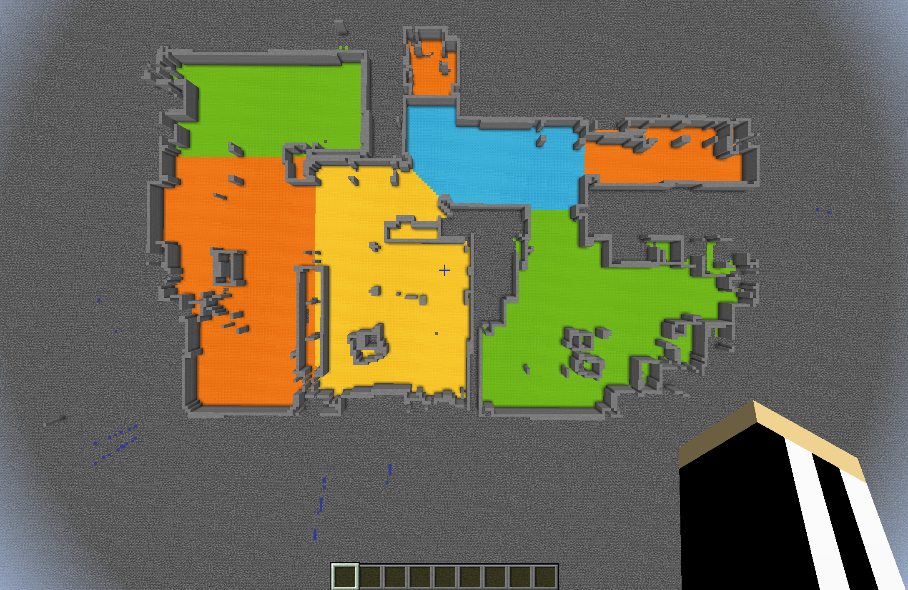

# Valetudo Minecraft Mapper

A small and rather hackish script, which takes a ValetudoMap JSON and renders it to a Minecraft World.

[https://github.com/Hypfer/Valetudo-Minecraft-Mapper](https://github.com/Hypfer/Valetudo-Minecraft-Mapper)

# Valetudo-To-VMF

A script to convert Valetudo Mapdata (containing segments) to Source-Engine VMF Maps (for use with the Hammer Editor).

[https://github.com/Sch1nken/Valetudo-To-VMF](https://github.com/Sch1nken/Valetudo-To-VMF)

# Remote control using a Gamepad

## PyGame-based Valetudo Gamepad Remote Control

[https://gist.github.com/Depau/904ce14b04d935b6f9829cdf2cda64f3](https://gist.github.com/Depau/904ce14b04d935b6f9829cdf2cda64f3)

## valetudo_gamepad_experiments_v1.js 

[https://gist.github.com/Hypfer/fcfa39996bd7522bbe2c5f18acb1fcf4](https://gist.github.com/Hypfer/fcfa39996bd7522bbe2c5f18acb1fcf4)
