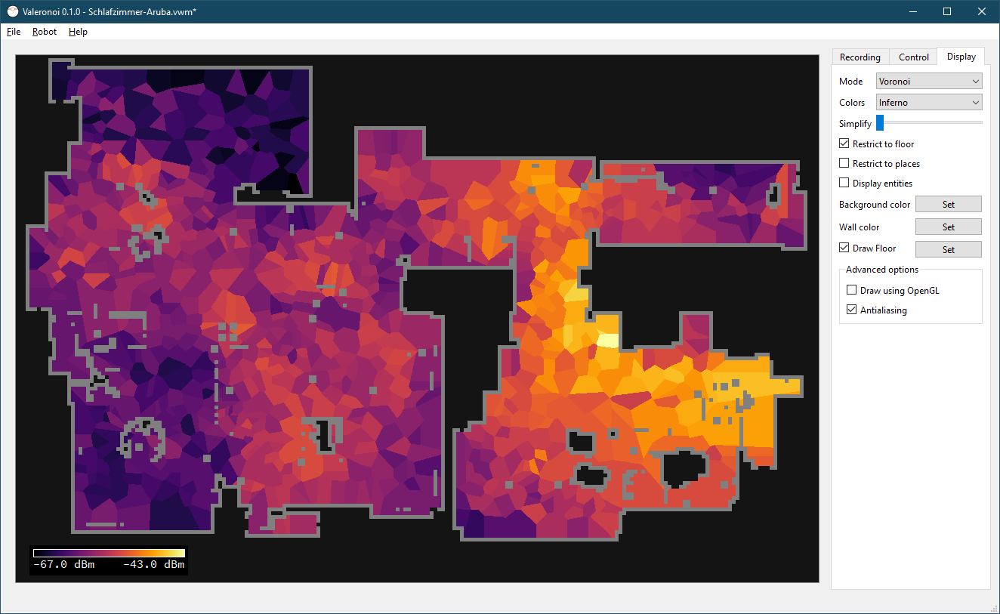

# Valeronoi

Valeronoi (Valetudo + Voronoi) is a companion for [Valetudo](https://valetudo.cloud) for generating WiFi signal strength maps. It visualizes them using a [Voronoi diagram](https://en.wikipedia.org/wiki/Voronoi_diagram).

For more information, check out [https://github.com/ccoors/Valeronoi](https://github.com/ccoors/Valeronoi)
