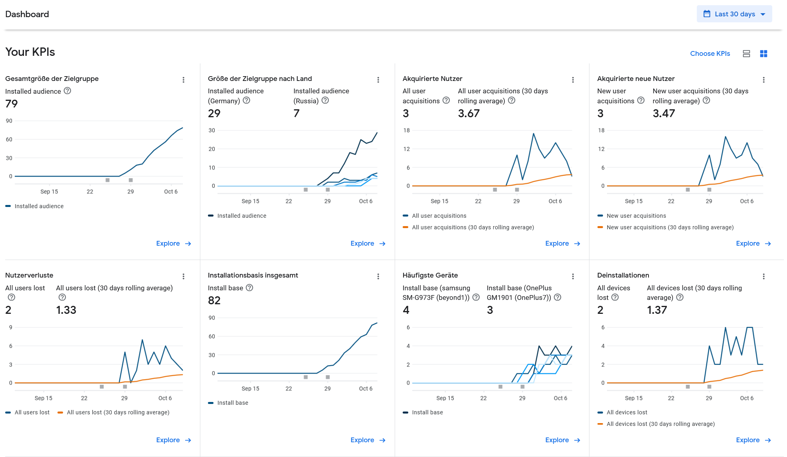

# Valetudo Companion (Android)

The Valetudo Companion android app listens for Bonjour broadcasts of recent (2021.07.0++) Valetudo instances on your network
and will display each one in a list to make it easy to access them without needing to set up
static DHCP leases or looking into your routers webinterface.

Furthermore, it allows for easy provisioning of new instances without having to mess with mobile data settings.

Note that this app is completely optional and only exists to make Valetudo more accessible.
This app will not provide any UI to interface with Valetudo during normal operation.
Basically, you can think of it as an automatically updating bookmark + some wizard stuff.

Its sourcecode is available on GitHub (Apache-2.0): [https://github.com/Hypfer/valetudo-companion](https://github.com/Hypfer/valetudo-companion)

## How to Install

The preferred way of obtaining the App is of course [F-Droid](https://f-droid.org/repository/browse/?fdid=cloud.valetudo.companion).

You can also find it on the [Google Play Store](https://play.google.com/store/apps/details?id=cloud.valetudo.companion), however do note that even though this App itself doesn't contain any tracking,
the Play Store will in fact collect anonymous usage data. This applies to all Apps downloaded from there btw.

## Screenshots

## Transparency

As mentioned above, the Google Play Store will collect metrics about you and provide them to me.
This is an overview of some of the data that gets collected:

Furthermore, reviews will contain
- your full name
- the device you're using
- the device language

Overall nothing terrible but I personally find it important to know that this is happening.

## Immensely stupid legal attribution

*Google Play and the Google Play logo are trademarks of Google LLC.*
