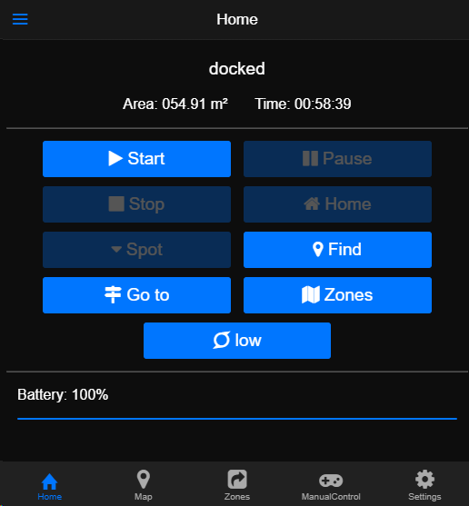
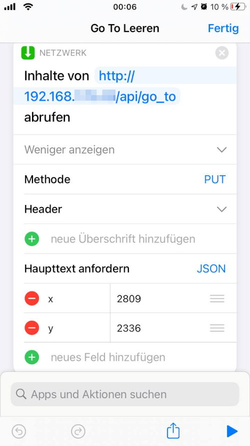
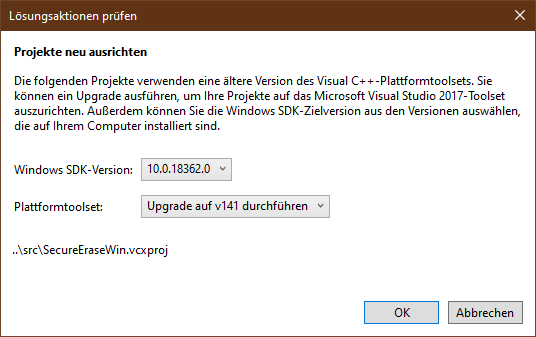

# Frequently requested features

## Translation support 

While a lot of people are asking for this feature, I'm afraid it won't happen anytime soon if ever.

Let me explain the reasoning behind this with an example. Consider this car radio in a car made for the german market:

In fact, the radio is engineered by Bosch in Hildesheim. Still, the button isn't labeled `Karte`.

Now, let's take a look at the Valetudo UI (Version 0.6.1):

Regarding overall complexity, it's comparable to the buttons on the radio.
It's even easier to understand, because there are a lot more icons.  
Considering that people do in fact manage to use their car radios even if their english skills may be lacking,
I'd say that **accessibility** isn't a problem here.

As a matter of fact, Internationalization isn't free. It always introduces more work, more complexity etc. 
Of course **accessibility** is often worth the effort, however since we've already established that this factor isn't relevant here, 
we can take a look at a non-exhaustive list of downsides of i18n:

* Getting support is harder when screenshots/error messages are in a language that isn't english, because supporters may not speak it
* Development of new features, refactoring etc. is always blocked by having to translate everything new to all languages
* Increased codebase complexity
    * Harder to read
    * Harder to work with
* Lots of initial work to translate everything
    * Time/effort that could be spent better elsewhere

Now, let us look at another real-world example of i18n.

This is a screenshot of Apple Shortcuts running on an iPhone set to the German locale.
It is just a basic HTTP PUT with a JSON payload.
For some reason however, "Header" as in "HTTP Header" was translated to "Überschrift" which means "Headline".
Even worse, "Request body" became "Haupttext anfordern" which translated back to english means "(to) request the main text"???

This is another example. Here we have the Integrated Development Environment Visual Studio 2017 made by Microsoft
attempting to open a project file that was created in an older version of Visual Studio.

Instead of asking us if we want to change the target SDK of the project file - which is called solution in Visual Studio -
it is showing us a dialog titled "Lösungsaktionen prüfen" which translates back to "check actions to solve something".
Then there's a sub-header labelled "Projekte neu ausrichten" which translates to "realign projects" (plural).

The only way I was able to decipher what that dialog even means was by opening the same project on a different system
with the locale being set to en-US.

In both examples, the actual meaning got lost in translation, which is a common issue.
Even with german being a common language and understanding of the HTTP protocol being fairly common as well.

Preventing this is hard, because you will need someone who understands the project from a technical standpoint as well as speaks the language it should be translated to.
This is also required even if the translation is done by someone else, because you still have to validate what they did.

As even huge corporations known for being user-friendly and also paired with insane budgets fail to do this all the time,
I don't think that it is actually a feasible task.

# Multiple Maps / Multi-Floor 

Multiple maps are a feature that is inherently linked to a huge increase in code complexity since most functionality
of the robot needs to be aware of not only that there are multiple maps but also, which one is the current one.

It gets even worse when there are multiple versions of each map due to stuff like automated snapshots/backups.

This change costs time and therefore money, but it is not just a one-time payment. The increase in complexity is permanent
meaning that the cost of maintaining the codebase is also increased permanently.

Even if there was a PR to reduce the initial cost, it would still not be merged due to its permanent impact
on the running costs. 
Implementing multi-floor support was already investigated multiple times with each iteration resulting in the discovery
of even more things that make this hard to pull off using Valetudo.

A lot of stuff in the robots core operation logic assumes that the cloud is always available with a permanent storage
of all data such as maps uploaded to it in some database or similar.
Sometimes, the robot will report to the cloud that it won't upload the requested map file again as instead
the cloud should use file with ID XYZ. This works fine when the cloud is actually the cloud but breaks entirely
when the "cloud" is Valetudo with no persistent storage of uploads.

Adding persistence also isn't feasible, because you'd need to store everything all the time as you can never know
if an uploaded artifact might become relevant later. There are simply not enough resources to do that on the robot.

Furthermore, since vacuum robots cannot climb stairs, the whole multi-floor experience is just objectively inferior
as you loose the ability to do all the fancy automation stuff with robots starting to clean a room as soon as everyone has left etc.

And lastly, as of now (2021-10-23), you can get a factory-new robot supported by Valetudo for less than 150€. 
If you own a multi-floor home, there is absolutely no possibility that you're unable to afford that.
