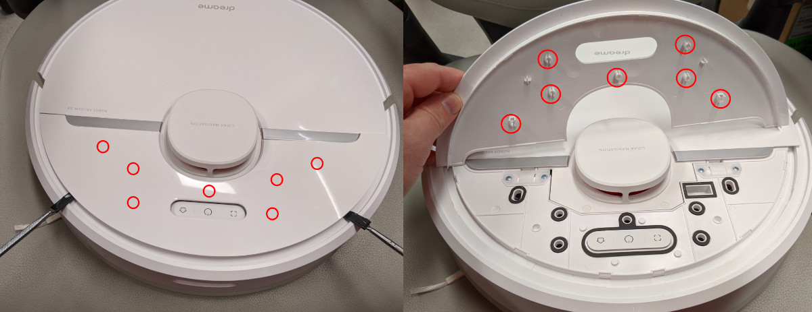
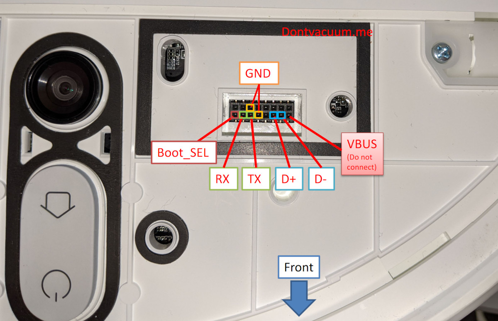

# Rooting instructions

This page contains an incomplete overview of installation instructions for various robots.

## Requirements

### Skills

Rooting robots is an advanced topic the same way working on a car, your electrical installation or any complex machinery is.
All these things require prior knowledge before attempting to do them or else they may fail catastrophically killing you and/or other people in the process.

While messing up the robot root procedure likely won't harm you, it may still cause a **permanently bricked robot** or
at least annoy the people supporting other Valetudo users in their free time.

Thus, to safely root your robot and install Valetudo, you will need prior knowledge in:
- GNU+Linux-based operating systems
- usage of a text-based shell (the Terminal)
- an understanding of how networks work, what an IP address is, what a webserver is, etc.
- and more.

If you don't know these and don't want to research them yourself, consider asking a friend, relative, colleague or your
nearest computer repair shop for help as teaching these basics is beyond the scope of the Valetudo docs.

It's also not feasible, since different people might start with different knowledge and therefore would require different information.
We can't mirror half of Wikipedia here.


### Software

This guide expects you to run some **GNU+Linux distribution** such as Debian, Fedora, Arch, Ubuntu or similar.
You don't have to install it. Booting from a live USB/DVD will be sufficient.

If you're running **Windows**, usage of the Windows Subsystem for Linux (WSL) is also often possible. If you haven't heard of that yet,
I'd strongly suggest researching it. It's basically the best of both worlds.

**MacOS** is not supported and will cause all sorts of trouble during some rooting procedures due to e.g., the `md5sum` command
behaving differently from the one that you'd find in most linux distributions.


## Dreame

Dreame rooting is currently possible for

* Dreame L10 Pro
* Dreame Z10 Pro
* Dreame F9
* Dreame D9
* Xiaomi Vacuum Robot 1C
* Xiaomi Vacuum Robot 1T

It has been released with Dennis Giese's DEF CON 29 Talk [Robots with lasers and cameras but no security Liberating your vacuum](https://youtu.be/EWqFxQpRbv8?t=1525).
For more information, head over to the [Dustbuilder](https://builder.dontvacuum.me/).

It is also recommended to join the [Dreame Robot Vacuum Telegram Usergroup](https://t.me/+L4lvcdTo8sUwZDVi) for rooting support etc.

### Reset-Button UART

**This was patched in many new firmwares. Do NOT update your robot via the Mi Home app if you want to root.**

There are other ways to root as well, however this one is very easy and very reliable so use that if you can.
What we're doing is basically just injecting a custom OTA update including hooks for valetudo, and sshd etc.

To do this, you'll only need a 3.3V USB to TTL Serial UART Adapter (like CP2102 or Pl2303) and dupont cables. Basic linux knowledge and a pry tool will help as well.

<div class="alert alert-tip" role="alert">
  <p>
    <strong>Note:</strong><br/>
    If this doesn't work on your robot, and it is an 1C, D9, F9 or Z500, your firmware might be too old.
    In that case, try <a href="https://gist.github.com/stek29/5c44244ae190f3757a785f432536c22a" rel="noopener" target="_blank">this guide</a>.
  </p>
</div>



To open the robot, gently pry up with a pry tool or your fingers on the smaller half with the buttons. Taking this plastic off is probably the hardest step.

Once you have the cover off, you need to connect your USB to Serial UART adapter to the robot. Make sure your adapter is set to 3.3V if has the option to change to something else.
You only need 3 wires for this connection (GND, RX, and TX).
Connect GND on the adapter to any of ground ports on the robot first and then connect RX on the adapter to TX on the robot and TX on the adapter to RX on the robot. Lastly, plug the adapter into your laptop.




Now you have to open a serial connection from your laptop to the device, this can be done with putty, miniterm, minicom or through a tool like screen with the following command: `screen /dev/ttyUSB0 115200,ixoff`.
The baud rate is 115200 and flow control (XIN, XOUT) needs to be off.
Your user also needs to have permission to access `/dev/ttyUSB0` which usually either means being root or part of the `dialout` group.
If your tool supports it, activate logging of the session to a file, for screen use `screen -L /dev/ttyUSB0 115200,ixoff`, for putty go to Session -> Logging and activate "All session output". When you execute the commands
to backup the calibration and identity data (see below) the output will be saved to the log file. Make sure to check the log file and store it in a secure place.

Once your connection is ready, turn on the vacuum by pressing and holding the middle button (POWER) for at least 3 seconds. 

You should see some logs and one of the last ones will say root password changed.
If you instead see some random characters, check your cabling.

To use the Wifi Reset method, open up the other side of the robot and press the reset button shortly (<1 second) with a pen or paperclip.
Your UART connection should pop up with the login prompt like `"p2029_release login”`

When connected, you can log in as `root` and then it will ask for a password.
To calculate the password use the full serial number of your robot, which can be found on the sticker below the dustbin.
**Not the one on the bottom of the robot nor the one on the packaging. You'll have to take out the dustbin and look below it into the now empty space.**


To get the password, use the following [Calculator](https://gchq.github.io/CyberChef/#recipe=Find_/_Replace(%7B'option':'Regex','string':'(%5C%5Cn%7C%5C%5Cr)'%7D,'',true,false,true,false)MD5()Find_/_Replace(%7B'option':'Regex','string':'$'%7D,'%20%20-%5C%5Cn',false,false,false,false)To_Base64('A-Za-z0-9%2B/%3D')&input=UDIwMDkwMDAwRVUwMDAwMFpN) 
or enter the full SN (all uppercase) into this shell command
`echo -n "P20290000US00000ZM" | md5sum | base64`

Once logged in, build a patched firmware image for manual installation via the [Dustbuilder](https://builder.dontvacuum.me).
**Make sure that both `Prepackage valetudo` and `Patch DNS` are selected before clicking on `Create Job`.**
You will receive an email once it's built. Download the `tar.gz` file from the link in that mail to your laptop.

With the `tar.gz` downloaded, head over to <a href="https://github.com/Hypfer/valetudo-helper-httpbridge" rel="noopener" target="_blank">https://github.com/Hypfer/valetudo-helper-httpbridge</a>
and download a matching binary for your laptops operating system.

Now, connect the laptop to the Wi-Fi Access Point of the robot. If you can't see the robots Wi-Fi AP to connect to, it might have disabled itself because 30 minutes passed since the last boot.
In that case, press and hold the two outer buttons until it starts talking to you.

The next step is to start the utility webserver. On Windows, a simple double-click on the exe should do the trick. **Don't close that window until you're done.**
The server will create a new `www` directory right next to itself as well as print out a few sample commands explaining how to download from and upload to it.

Make sure that it is listening on an IP in the range of `192.168.5.0/24` and then copy the downloaded `tar.gz` to the newly created `www` folder.

<div markdown="1" class="emphasis-box">
<div class="alert alert-important" role="alert">
  <p>
    <strong>Important:</strong><br/>
    Before you continue with the rooting procedure of your robot, please make sure to create a backup of your calibration and identity data to allow for disaster recovery.
</p>
</div>

The easiest way of doing this is by creating a tar archive of everything important and then uploading it to your laptop,
which at this point should be connected to the robots Wi-Fi AP.

To do that, head back to the UART shell and create a tar file of all the required files like so: 

```
tar cvf /tmp/backup.tar /mnt/private/ /mnt/misc/ /etc/OTA_Key_pub.pem /etc/publickey.pem
```

Then, look at the output of the `valetudo-helper-httpbridge` instance you've started previously.
It contains an example curl command usable for uploading that should look similar to this one:

```
curl -X POST http://192.168.5.101:33671/upload -F 'file=@./file.tar'
```

Change the file parameter to `file=@/tmp/backup.tar`, execute the command and verify that the upload to your laptop
was successful. If everything worked out correctly, you should now see a backup.tar with a non-zero size in `www/uploads`.

If you're experiencing issues, make sure that you've specified the correct port.

</div>

🦆 - *this will be important later*

After uploading the backup and storing it in a safe place, you can now download the firmware image file that you've
previously put in the `www` directory. `valetudo-helper-httpbridge` will tell you the correct command, which should look
similar to this: 

```
wget http://192.168.5.101:33671/file.tar
```
The `file.tar` part will of course be different.

After downloading the firmware image tar to your working directory (`/tmp`), it should be untared: `tar -xvzf dreame.vacuum.pxxxx_fw.tar.gz`.
Now, make sure that the robot is docked and then run the newly extracted installation script: `./install.sh`.

The robot will install the rooted firmware image and then reboot **on its own**. Please be patient.

After the robot has finished the installation, you should see a new MOTD (message of the day) on your UART shell.
It should look similar to this:

```
build with dustbuilder (https://builder.dontvacuum.me)
Fri 04 Feb 2022 10:08:21 PM UTC
1099
```

If you see that MOTD, the rooting procedure was successful.
**However**, you're not done yet!

The dreame robots rooted by this guide actually have two rootfs partitions.
It's a similar setup to the A/B System Partitions that enable seamless Android OS updates on recent (~2017 and newer) Android phones.

To ensure that you'll have a rooted system even in the unlikely event of a boot failure of the currently active partition,
you should flash both root partitions with a rooted firmware images. 
To do that, simply scroll back up to the duck emoji 🦆 and continue from there a second time.


All done? Good.
You now have a rooted Dreame vacuum robot running Valetudo.

Now continue with the [getting started guide](https://valetudo.cloud/pages/general/getting-started.html#joining_wifi).

## Roborock

For more information, simply click on the link if there is one.
Overall, things got harder as time went by.

### OTA

The ***O**ver-**t**he-**A**ir[-Update]* rooting method is the easiest one requiring no disassembly nor attaching any cables. However, since Xiaomi disabled local OTA in newer versions of the `miio_client` (> 3.3.9), you might need to downgrade your firmware by factory resetting your robot.

Unfortunately, robots made after 2020-03 come with a non-local-OTA capable recovery firmware version so for those robots
you will need to follow the instructions below.

This works by using the official OTA update mechanism to push a customized (rooted + valetudo) firmware image to the robot.
It will happily accept that, because they aren't signed. For more information, check out the talk
[Unleash your smart-home devices: Vacuum Cleaning Robot Hacking](https://media.ccc.de/v/34c3-9147-unleash_your_smart-home_devices_vacuum_cleaning_robot_hacking). 


The procedure is documented here: [https://valetudo.cloud/pages/installation/roborock-ota.html](https://valetudo.cloud/pages/installation/roborock-ota.html)

This method applies to the following robots:
* Roborock V1 pre 2020-03
* Roborock S5

### Vinda

The vinda file method unfortunately requires full disassembly of the robot as well as soldering some wires which will
void your warranty.

In short, there's a file called `vinda` which contains the root password XOR'd with `0x37`.
By dropping into the u-boot shell, you can use the `ext4load` u-boot command usually used for loading a kernel to load
that file into memory and therefore read out the root password.

Then, you simply use an interactive shell via UART to achieve persistence.

Dennis made two videos explaining both disassembly as well as the actual root procedure.
They can be found here: [https://www.youtube.com/playlist?list=PL9PoaNtZCJRZc61c792VCr_I6jQK_IdSb](https://www.youtube.com/playlist?list=PL9PoaNtZCJRZc61c792VCr_I6jQK_IdSb)

This method applies to the following robots:
* Roborock V1 post 2020-03
* Roborock S6 pre 2020-06 (?)
* Roborock S4

Don't be confused by the Video not mentioning your particular robot model.
It's the same procedure for all robots listed here.

Also, your robot might come with a newer firmware which doesn't feature a `vinda` file.
In that case, you'll need to follow the instructions below.

### Init override

Since there's no `vinda` file on these robots/firmwares, the approach here is to drop into the u-boot shell and edit the
kernel commandline so that `init` becomes `/bin/sh` which also gives you a rootshell, but requires you to quickly do some
initializing, because otherwise the hardware watchdog will reboot the robot.

Furthermore, due to limited storage, the new firmware is actually streamed onto the device.

The disassembly process plus the testpoints used are the same as the vinda method above so make sure to watch those videos
before attempting this.

The procedure is documented here: [https://builder.dontvacuum.me/s5e-cheatsheet.txt](https://builder.dontvacuum.me/s5e-cheatsheet.txt)

This method applies to the following robots:
* Roborock S6 post 2020-06 (?)
* Roborock S5 Max
* Roborock S6 Pure
* Roborock S4 Max
