# Supported Robots

If you're interested in hardware specifics, teardowns and more, check out Dennis Giese's [Vacuum Robot Overview](https://robotinfo.dev/).

Please note that this list is exhaustive. These are the supported robots. 
Robots not on this list are not supported by Valetudo. If your robot is not on this list, it is not supported.

Unless noted otherwise, these robots were all tested by me personally to ensure that:
- They work properly with Valetudo
- The way to get them to work with Valetudo is well documented
- I have an Idea how the thing works, how rooting works and what to do when things don't work

Being _supported_ means meeting these criteria. Only by fulfilling these conditions can a robot be deemed supported.

## Robots that aren't supported

While Valetudo tries its best to be generic and reuse code wherever possible, since it is not a custom firmware,
the backend is basically a few huge chunks of code that are very specific to the respective vendor firmware and cloud architecture they try to emulate.

Supporting any new vendors is thus quite a large task because not only requires it to write large parts of the backend
again from scratch but also do the reverse engineering of data formats, authentication, communication and various functionality
with no documentation from the vendor available.

It's a time-consuming process that mostly involves random chance and that can only start once security vulnerabilities
leading to system administrator level access on the hardware in question has been found. A similar reverse-engineering process
without any documentation that is also quite time-consuming and mostly involves random chance.

 

Valetudo only runs on the supported robots because security researcher [Dennis Giese](https://dontvacuum.me) found ways
to root them.

Rooting in this context means taking these locked-down IoT devices, finding and exploiting security flaws in their design
and gaining permanent system administrator level access to them to allow for running additional custom software such as Valetudo
and modifying the system to make the unclouding possible.

These security flaws are all 0days of which we sometimes need multiple to achieve the rooting. 
They're also specific to one specific vendor's implementation of something on one specific piece of hardware.

With a public root release, these get burned and usually quickly fixed by the vendors, making finding a working exploit chain
for newer models after the release harder or sometimes even impossible.

 

Therefore, please refrain from asking if something that isn't on this list is supported. 
Please do not ask if someone "tried" it. Please do not state that you would like it if something would be supported.

Without explicitly mentioning this, readers often expect that something not being supported just means that
no one has tried it yet, which is more akin to how e.g. running GNU+Linux on some random laptop works.

Thank you for your understanding

## Table of Contents

Hint: 
You can use Ctrl + F to look for your model of robot. 

1. [Xiaomi](#xiaomi)
   1. [V1](#xiaomi_v1)
   2. [1C](#xiaomi_1c)
   3. [1T](#xiaomi_1t)
   4. [P2148](#xiaomi_p2148)
   5. [Vacuum-Mop P](#xiaomi_vacuummop_p)
   6. [Vacuum-Mop 2 Ultra](#xiaomi_p2150)
   7. [X10 Plus](#xiaomi_x10plus)
2. [Dreame](#dreame)
   1. [D9](#dreame_d9)
   2. [D9 Pro](#dreame_d9pro)
   3. [F9](#dreame_f9)
   4. [L10 Pro](#dreame_l10pro)
   5. [Z10 Pro](#dreame_z10pro)
   6. [W10](#dreame_w10)
   7. [W10 Pro](#dreame_w10pro)
   8. [L10s Ultra](#dreame_l10sultra)
   9. [D10s Pro](#dreame_d10spro)
   10. [D10s Plus](#dreame_d10splus)
   11. [L10s Pro Ultra Heat](#dreame_l10sproultraheat)
   12. [L40 Ultra](#dreame_l40ultra)
   13. [X40 Ultra](#dreame_x40ultra)
   14. [X40 Master](#dreame_x40master)
3. [Roborock](#roborock)
   1. [S5](#roborock_s5)
   2. [S6](#roborock_s6)
   3. [S6 Pure](#roborock_s6pure)
   4. [S4](#roborock_s4)
   5. [S4 Max](#roborock_s4max)
   6. [S5 Max](#roborock_s5max)
   7. [S7](#roborock_s7)
   8. [S7 Pro Ultra](#roborock_s7proultra)
   9. [Q7 Max](#roborock_q7max)
4. [MOVA](#mova)
   1. [Z500](#mova_z500)
   2. [S20 Ultra](#mova_s20ultra)
   3. [P10 Pro Ultra](#mova_p10proultra)
5. [Viomi](#viomi)
   1. [V6](#viomi_v6)
   2. [SE](#viomi_se)
6. [Eureka](#eureka)
   1. [J15 Pro Ultra](#eureka_j15pu)
7. [Cecotec](#cecotec)
   1. [Conga 3290](#conga_3290)
   2. [Conga 3790](#conga_3790)
8. [Proscenic](#proscenic)
   1. [M6 Pro](#proscenic_m6pro)
9. [Commodore](#commodore)
   1. [CVR 200](#commodore_cvr200)
10. [IKOHS](#ikohs)
    1. [Netbot LS22](#ikohs_ls22)

## Xiaomi

Robots sold under the Xiaomi brand are actually made by varying manufacturers. 
Don't assume any compatibility of consumables or other parts as well as rooting instructions.

### Xiaomi V1

The Xiaomi V1 is made by Roborock. It is sold as:
- Xiaomi Mi Robot Vacuum

#### Comments

**Note:** 
This robot never received firmware updates that enable persistent maps. This means that it creates a new one on every cleanup. 
There are no virtual walls etc. Do **not** buy this new. There are **much better options**.

Rooting is pretty easy if your device was manufactured before 2020-03. 
In that case, it only requires a Laptop. All warranty seals stay intact.

If your robot is newer than that, full disassembly will be required.

#### Details

**Valetudo Binary**: `armv7`

#### Rooting instructions

- [OTA (before 2020-03)](https://valetudo.cloud/pages/installation/roborock.html#ota)
- [Vinda (after 2020-03)](https://valetudo.cloud/pages/installation/roborock.html#vinda)

### Xiaomi 1C

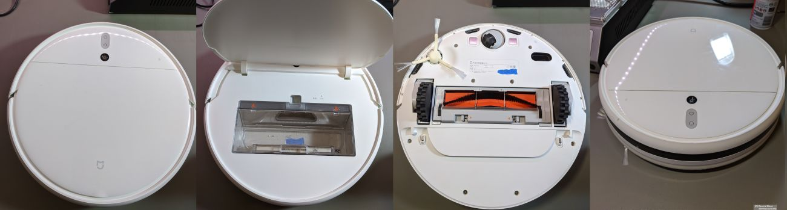

The Xiaomi 1C is made by Dreame. It is sold as:
- Mi Robot Vacuum-Mop
- Xiaomi 1C
- STYTJ01ZHM

#### Comments

**Important note:**  
There are multiple hardware revisions under the same name. Only the `dreame.vacuum.mc1808` is currently supported. 
You can distinguish the different revisions by looking at the SSID of the Wi-Fi AP of the robot.

Rooting is pretty easy, only requiring a 3.3v USB UART Adapter, [the Dreame Breakout PCB](https://github.com/Hypfer/valetudo-dreameadapter) and almost no disassembly.
All warranty seals stay intact.

If you only see weird characters on the UART, try `500000` instead of `115200` as the baud rate.

#### Details

**Valetudo Binary**: `armv7`
**Secure Boot**: `no`

#### Rooting instructions

- [UART](https://valetudo.cloud/pages/installation/dreame.html#uart)
- [Init override (may be patched)](https://gist.github.com/stek29/5c44244ae190f3757a785f432536c22a)

### Xiaomi 1T

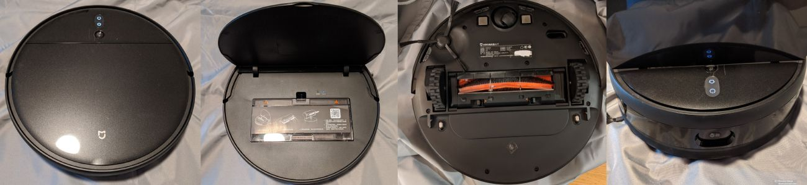

The Xiaomi 1T is made by Dreame. It is sold as:
- Mi Robot Vacuum-Mop 2 Pro+
- Xiaomi Mijia 1T (CN)
- Mi Robot Vacuum-Mop 1T (CN)
- STYTJ02ZHM

#### Comments

Rooting is pretty easy, only requiring a 3.3v USB UART Adapter, [the Dreame Breakout PCB](https://github.com/Hypfer/valetudo-dreameadapter) and almost no disassembly.
All warranty seals stay intact.

On initial root, it might be required to do a factory reset so that the device.conf gets regenerated.
Note that that factory reset will also remove Valetudo meaning that you will have to put it back after that.

#### Details

**Valetudo Binary**: `aarch64`
**Secure Boot**: `no`

#### Rooting instructions

- [UART](https://valetudo.cloud/pages/installation/dreame.html#uart)

### Xiaomi P2148

The Xiaomi P2148 is made by Dreame. It is sold as:
- Mijia Robot Vacuum-Mop Ultra Slim
- Mijia Robot Vacuum Mop Ultra Slim
- Xiaomi Mijia Ultra-Thin Robot Vacuum
- Xiaomi Mijia Ultra Slim

#### Comments

Rooting is pretty easy, only requiring a 3.3v USB UART Adapter, [the Dreame Breakout PCB](https://github.com/Hypfer/valetudo-dreameadapter) and almost no disassembly.
All warranty seals stay intact.

With its 5.5cm height and 32.3cm diameter, this robot offers a solution for some tricky homes.
As it is china exclusive, spare parts may be hard to find in the rest of the world.

On initial root, it might be required to do a factory reset so that the device.conf gets regenerated.
Note that that factory reset will also remove Valetudo meaning that you will have to put it back after that.

There is no reset button on this robot. Instead, press and hold the two buttons for
- \< 1s for the UART shell spawn
- \> 3s for Wi-Fi reset
- \> 5s for full factory reset

#### Details

**Valetudo Binary**: `aarch64`
**Secure Boot**: `no`

#### Rooting instructions

- [UART](https://valetudo.cloud/pages/installation/dreame.html#uart)

### Xiaomi Vacuum-Mop P

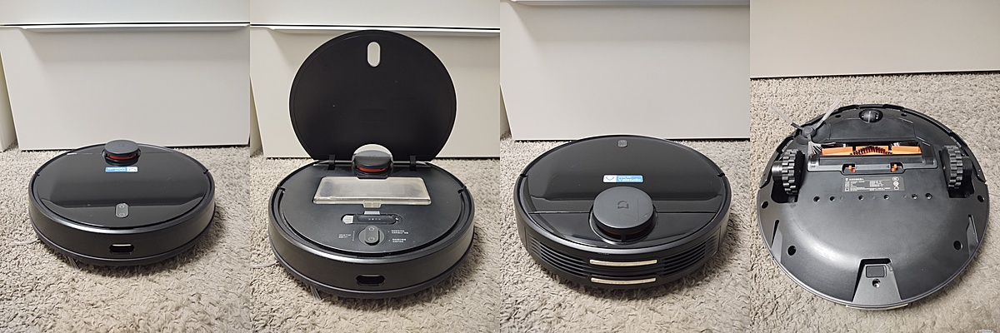

The Vacuum-Mop P is using the Viomi cloud stack but is actually made by 3irobotix. 
There are three robots with different IDs under this name, and they're all 3irobotix CRL-200S inside. 
It's very confusing. If unsure, please ask us first.

These are sold under the names:
- Mi Robot Vacuum-Mop P
- Mi Robot Vacuum-Mop Pro (not the ijai one!!)
- Mijia STYJ02YM

#### Comments

Rooting is pretty easy, only requiring a Linux Laptop and a micro USB cable. 
It might be required to remove the battery but that can be done without touching any warranty seals.

**Warning**: 
Do not try to root the viomi.vacuum.v8 as there are many of them that will unrecoverably brick if you try to do so.
You can check if yours is a v8 by looking at the SSID of the WiFi AP the robot creates.

**Note:** 
While Valetudo works with their model firmwares, the recommended rooting procedure is to flash these with a Viomi V6 firmware as that has more features.

#### Details

**Valetudo Binary**: `armv7`

#### Rooting instructions

- [ADB](https://github.com/Hypfer/valetudo-crl200s-root)

### Xiaomi Vacuum-Mop 2 Ultra

The Xiaomi Vacuum-Mop 2 Ultra is made by Dreame. It is sold as:
- Mi Robot Vacuum-Mop 2 Ultra
- Mi Robot Vacuum-Mop 2 Ultra + Auto-empty station
- BHR5195EU

#### Comments

Rooting is pretty easy, only requiring a 3.3v USB UART Adapter, [the Dreame Breakout PCB](https://github.com/Hypfer/valetudo-dreameadapter) and almost no disassembly.
All warranty seals stay intact.

#### Details

**Valetudo Binary**: `aarch64`
**Secure Boot**: `yes (since FW 1167)`

#### Rooting instructions

- [UART](https://valetudo.cloud/pages/installation/dreame.html#uart)

### Xiaomi X10 Plus

The Xiaomi Robot Vacuum X10 Plus is made by Dreame. It is sold as:
- Xiaomi Robot Vacuum X10 Plus
- Xiaomi Robot Vacuum X10+

#### Comments

Rooting is pretty easy, only requiring a 3.3v USB UART Adapter, [the Dreame Breakout PCB](https://github.com/Hypfer/valetudo-dreameadapter) and almost no disassembly.
All warranty seals stay intact.

#### Details

**Valetudo Binary**: `aarch64`
**Secure Boot**: `yes`

#### Rooting instructions

- [UART](https://valetudo.cloud/pages/installation/dreame.html#uart)

## Dreame

### D9 

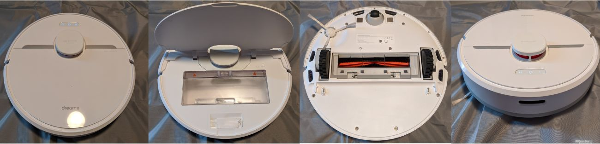

The Dreame D9 is Dreame's first ever Lidar-based vacuum robot. It is sold as:
- Dreame D9

It is **NOT** sold as the D9 Max. That is an entirely different robot. Only the D9 non-max is supported. 
To ensure that you get the supported D9, make sure that it has 3 buttons.

#### Comments

Rooting is pretty easy, only requiring a 3.3v USB UART Adapter, [the Dreame Breakout PCB](https://github.com/Hypfer/valetudo-dreameadapter) and almost no disassembly.
All warranty seals stay intact.

#### Details

**Valetudo Binary**: `armv7-lowmem`
**Secure Boot**: `no`

#### Rooting instructions

- [UART](https://valetudo.cloud/pages/installation/dreame.html#uart)

### D9 Pro

The Dreame D9 Pro is sold as:
- Dreame D9 Pro

#### Comments

**Important note:**  
Dreame never released any firmware updates for this robot. 
However, we were able to port the regular D9 firmware to it, which is a huge improvement over the stock D9 Pro experience.

Rooting is pretty easy, only requiring a 3.3v USB UART Adapter, [the Dreame Breakout PCB](https://github.com/Hypfer/valetudo-dreameadapter) and almost no disassembly.
All warranty seals stay intact.

#### Details

**Valetudo Binary**: `armv7-lowmem`
**Secure Boot**: `no`

#### Rooting instructions

- [UART](https://valetudo.cloud/pages/installation/dreame.html#uart)

### F9 

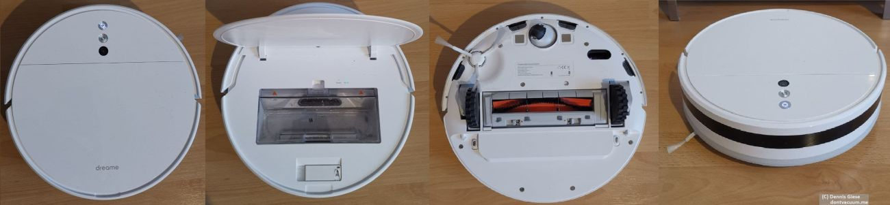

The Dreame F9 is sold as:
- Dreame F9

#### Comments

Rooting is pretty easy, only requiring a 3.3v USB UART Adapter, [the Dreame Breakout PCB](https://github.com/Hypfer/valetudo-dreameadapter) and almost no disassembly.
All warranty seals stay intact.

#### Details

**Valetudo Binary**: `armv7`
**Secure Boot**: `no`

#### Rooting instructions

- [UART](https://valetudo.cloud/pages/installation/dreame.html#uart)

### L10 Pro 

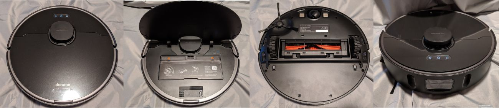

The Dreame L10 Pro is sold as:
- Dreame L10 Pro

#### Comments

Rooting is pretty easy, only requiring a 3.3v USB UART Adapter, [the Dreame Breakout PCB](https://github.com/Hypfer/valetudo-dreameadapter) and almost no disassembly.
All warranty seals stay intact.

#### Details

**Valetudo Binary**: `aarch64`
**Secure Boot**: `yes (since FW 1138)`

#### Rooting instructions

- [UART](https://valetudo.cloud/pages/installation/dreame.html#uart)

### Z10 Pro 

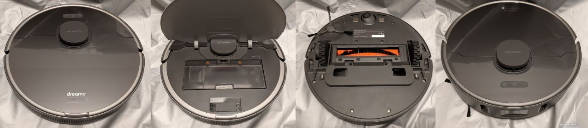

The Dreame Z10 Pro is sold as:
- Dreame Z10 Pro
- Dreame Bot L10 Plus (CN)

#### Comments

Rooting is pretty easy, only requiring a 3.3v USB UART Adapter, [the Dreame Breakout PCB](https://github.com/Hypfer/valetudo-dreameadapter) and almost no disassembly.
All warranty seals stay intact.

#### Details

**Valetudo Binary**: `aarch64`
**Secure Boot**: `yes (since FW 1156)`

#### Rooting instructions

- [UART](https://valetudo.cloud/pages/installation/dreame.html#uart)

### W10 

The Dreame W10 is sold as:
- Dreame W10

#### Comments

Rooting is pretty easy, only requiring a 3.3v USB UART Adapter, [the Dreame Breakout PCB](https://github.com/Hypfer/valetudo-dreameadapter) and almost no disassembly.
All warranty seals stay intact.

Due to the design of the dock, it might be difficult to have the robot docked while being connected to its UART.
One useful trick to solve that is this: `sleep 300 && ./install.sh`. With that, you will have a
300s window where you can disconnect the PCB and put it in the dock. The command will keep running.

#### Details

**Valetudo Binary**: `armv7-lowmem`
**Secure Boot**: `no`

#### Rooting instructions

- [UART](https://valetudo.cloud/pages/installation/dreame.html#uart)

### W10 Pro 

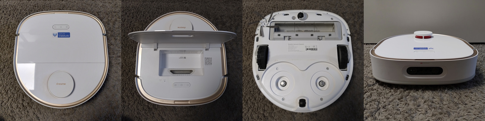

The Dreame W10 Pro is sold as:
- Dreame W10 Pro

#### Comments

Rooting is relatively easy. Usage of [the Dreame Breakout PCB](https://github.com/Hypfer/valetudo-dreameadapter) is highly recommended.
All warranty seals stay intact.

Due to the design of the dock, it might be difficult to have the robot docked while being connected to its UART.
One useful trick to solve that is this: `sleep 300 && ./install.sh`. With that, you will have a
300s window where you can disconnect the PCB and put it in the dock. The command will keep running.

On this robot, the miio cloudKey seems to only be stored in secure storage which broke cloud communication with Valetudo.
Here's a one-liner to fix that:
`mount -o remount,rw /mnt/private && printf "%s" "$(dreame_release.na -c 7 | awk -F' = ' '/MI_KEY/{print $2}')" > "/mnt/private/ULI/factory/key.txt" && mount -o remount,ro /mnt/private`

If you're rooting your W10 Pro, just run that command before setting up Valetudo. A reboot might be required.

#### Details

**Valetudo Binary**: `aarch64`
**Secure Boot**: `yes`

#### Rooting instructions

- [Fastboot](https://valetudo.cloud/pages/installation/dreame.html#fastboot)

### L10s Ultra 

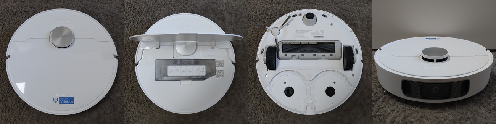

The Dreame L10s Ultra is sold as:
- Dreame L10s Ultra

It is **not sold** as the L10s Ultra **Gen2**. 
That's a completely different robot with a confusing name that is **not** supported.

You can tell the L10s Ultra from the unsupported but confusingly similar named L10 Ultra or the L10s Ultra Gen2 by its AI obstacle avoidance camera + the lack of an extendable mop.

#### Comments

Rooting is relatively easy. Usage of [the Dreame Breakout PCB](https://github.com/Hypfer/valetudo-dreameadapter) is highly recommended.
All warranty seals stay intact.

#### Details

**Valetudo Binary**: `aarch64`
**Secure Boot**: `yes`

#### Rooting instructions

- [Fastboot](https://valetudo.cloud/pages/installation/dreame.html#fastboot)

### D10s Pro 

The Dreame D10s Pro is sold as:
- Dreame D10s Pro

It is **NOT** sold as the D10s without the "Pro". That is an entirely different robot. Only the "Pro" is supported. 
To ensure that you get the supported "Pro", make sure that it has 3 buttons.

#### Comments

Rooting is relatively easy. Usage of [the Dreame Breakout PCB](https://github.com/Hypfer/valetudo-dreameadapter) is highly recommended.
All warranty seals stay intact.

#### Details

**Valetudo Binary**: `aarch64`
**Secure Boot**: `yes`

#### Rooting instructions

- [Fastboot](https://valetudo.cloud/pages/installation/dreame.html#fastboot)

### D10s Plus 

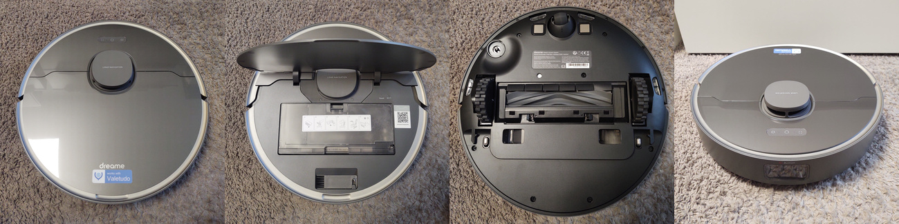

The Dreame D10s Plus is sold as:
- Dreame D10s Plus

It is **NOT** sold as the D10 Plus without the "s". That is an entirely different robot. Only the "s" is supported. 
To ensure that you get the supported "s", make sure that it has 3 buttons.

#### Comments

Rooting is relatively easy. Usage of [the Dreame Breakout PCB](https://github.com/Hypfer/valetudo-dreameadapter) is highly recommended.
All warranty seals stay intact.

#### Details

**Valetudo Binary**: `aarch64`
**Secure Boot**: `yes`

#### Rooting instructions

- [Fastboot](https://valetudo.cloud/pages/installation/dreame.html#fastboot)

### L10s Pro Ultra Heat 

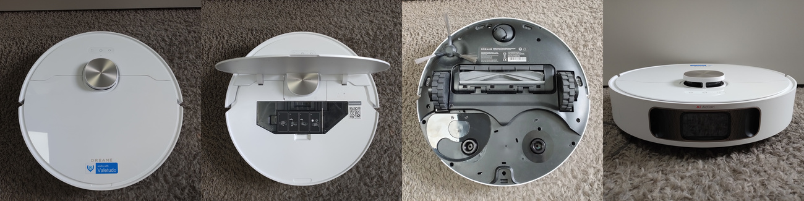

The Dreame L10s Pro Ultra Heat is sold as:
- Dreame L10s Pro Ultra Heat

#### Comments

If the robot fails to dock after rooting:
1. Dock it manually. Make sure that it is charging
2. Head to the dustbuilder
3. Build a firmware for manual install via SSH
4. SSH into the robot
5. Install the built firmware

The issue is that rooting flashes a newer firmware than the one installed from the factory; bypassing the normal update process.
As there seems to have been a breaking change in the communication between MCU and Linux-side-software, this breaks docking.

Installing a firmware package via SSH uses the normal OTA update process and with that fixes this mismatch.

Rooting is relatively easy. Usage of [the Dreame Breakout PCB](https://github.com/Hypfer/valetudo-dreameadapter) is highly recommended.
All warranty seals stay intact.

#### Details

**Valetudo Binary**: `aarch64`
**Secure Boot**: `yes`

#### Rooting instructions

- [Fastboot](https://valetudo.cloud/pages/installation/dreame.html#fastboot)

### L40 Ultra 

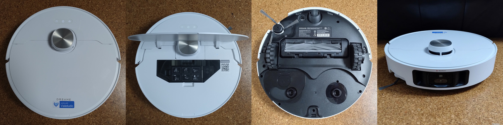

The Dreame L40 Ultra is sold as:
- Dreame L40 Ultra

It is **not sold** as the L40 Ultra **AE** nor as the L40**s Pro Ultra**. 
Those are completely different robots with confusing names that are **not** supported.

#### Comments

Rooting is relatively easy. Usage of [the Dreame Breakout PCB](https://github.com/Hypfer/valetudo-dreameadapter) is highly recommended.
All warranty seals stay intact.

#### Details

**Valetudo Binary**: `aarch64`
**Secure Boot**: `yes`

#### Rooting instructions

- [Fastboot](https://valetudo.cloud/pages/installation/dreame.html#fastboot)

### X40 Ultra 

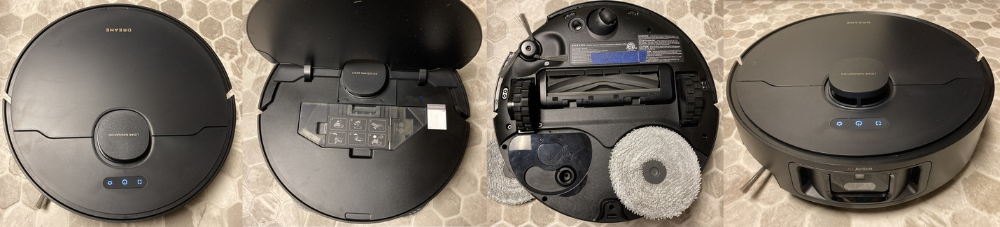

The Dreame X40 Ultra is sold as:
- Dreame X40 Ultra
- Dreame X40 Ultra Complete

#### Comments

Rooting is relatively easy. Usage of [the Dreame Breakout PCB](https://github.com/Hypfer/valetudo-dreameadapter) is highly recommended.
All warranty seals stay intact.

Please keep in mind that the goal of Valetudo is to have **a** cloud-free vacuum robot. 
It is **not** to have the Dreame X40 Ultra in all its glory but just with the cloud removed. 
Feature-parity is a non-goal for Valetudo, and if you're wondering which features "you might lose", Valetudo is not for you.

If the rooted robot does not want to stay connected to your Wi-Fi network, try this one-liner:
`rm -f /data/config/miio/wifi.conf /data/config/wifi/wpa_supplicant.conf /var/run/wpa_supplicant.conf; dreame_release.na -c 9 -i ap_info -m " "; reboot`

After that, you will have to reconfigure Wi-Fi using Valetudo.

If Valetudo doesn't want to auto-detect the robot, and it was made around 08/2025 or later, Dreame might've switched to negative
deviceIds, which are unexpected for miio. To solve that:

1. Check `/mnt/private/ULI/factory/did.txt`. Is it a negative number? If not, this is not your problem
2. `mount -o remount,rw /mnt/private`
3. ! BACKUP ! the original did. `cp /mnt/private/ULI/factory/did.txt /mnt/private/ULI/factory/did_orig.txt && sync`
4. Edit the file and make the did a positive number. `nano /mnt/private/ULI/factory/did.txt`, and save
5. `rm /data/config/miio/device.conf`. It will be regenerated on next boot
6. `reboot`
7. Ensure that Valetudo has now auto-detected the correct implementation and can talk to the robot via the miio stack

#### Details

**Valetudo Binary**: `aarch64`
**Secure Boot**: `yes`

#### Rooting instructions

- [Fastboot](https://valetudo.cloud/pages/installation/dreame.html#fastboot)

### X40 Master 

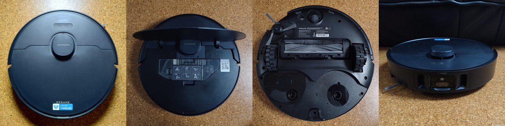

The Dreame X40 Master is sold as:
- Dreame X40 Master

#### Comments

Rooting is relatively easy. Usage of [the Dreame Breakout PCB](https://github.com/Hypfer/valetudo-dreameadapter) is highly recommended.
All warranty seals stay intact.

Please keep in mind that the goal of Valetudo is to have **a** cloud-free vacuum robot. 
It is **not** to have the Dreame X40 Master in all its glory but just with the cloud removed. 
Feature-parity is a non-goal for Valetudo, and if you're wondering which features "you might lose", Valetudo is not for you.

#### Details

**Valetudo Binary**: `aarch64`
**Secure Boot**: `yes`

#### Rooting instructions

- [Fastboot](https://valetudo.cloud/pages/installation/dreame.html#fastboot)

## MOVA

MOVA is a sub-brand(?) of Dreame

### MOVA Z500

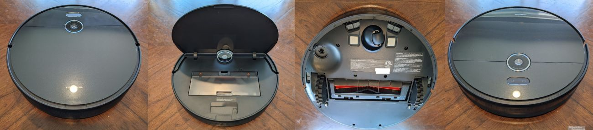

The MOVA Z500 is made by Dreame. It is sold as:
- MOVA Z500

#### Comments

Rooting is pretty easy, only requiring a 3.3v USB UART Adapter, [the Dreame Breakout PCB](https://github.com/Hypfer/valetudo-dreameadapter) and almost no disassembly.
All warranty seals stay intact.

#### Details

**Valetudo Binary**: `armv7`
**Secure Boot**: `no`

#### Rooting instructions

- [UART](https://valetudo.cloud/pages/installation/dreame.html#uart)

### S20 Ultra 

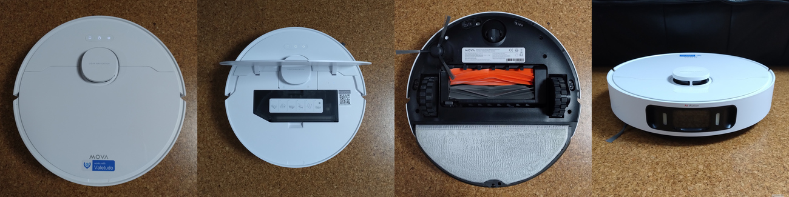

The Mova S20 Ultra is sold as:
- Mova S20 Ultra

#### Comments

Rooting is relatively easy. Usage of [the Dreame Breakout PCB](https://github.com/Hypfer/valetudo-dreameadapter) is highly recommended.
All warranty seals stay intact.

#### Details

**Valetudo Binary**: `aarch64`
**Secure Boot**: `yes`

#### Rooting instructions

- [Fastboot](https://valetudo.cloud/pages/installation/dreame.html#fastboot)

### P10 Pro Ultra 

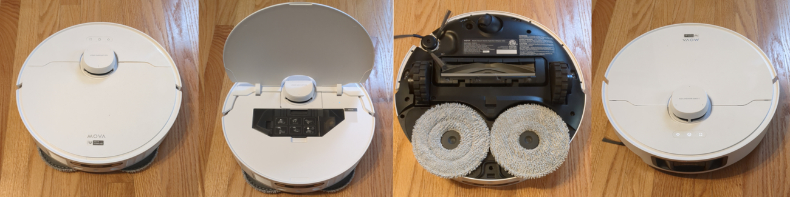

The Mova P10 Pro Ultra is sold as:
- Mova P10 Pro Ultra

It is **NOT** sold as the P10 Ultra. That is a different robot.

#### Comments

Rooting is relatively easy. Usage of [the Dreame Breakout PCB](https://github.com/Hypfer/valetudo-dreameadapter) is highly recommended.
All warranty seals stay intact.

#### Details

**Valetudo Binary**: `aarch64`
**Secure Boot**: `yes`

#### Rooting instructions

- [Fastboot](https://valetudo.cloud/pages/installation/dreame.html#fastboot)

## Roborock

### Roborock S5

The Roborock S5 is sold as:
- Roborock S5
- Xiaomi Mi Roborock S502-00

#### Comments

Rooting is pretty easy, only requiring a Laptop. All warranty seals stay intact.

Note that segment support is only available starting with firmware version 2008 so make sure you're up-to-date.

#### Details

**Valetudo Binary**: `armv7`

#### Rooting instructions

- [OTA](https://valetudo.cloud/pages/installation/roborock.html#ota)

### Roborock S6

The Roborock S6 is sold as:
- Roborock S6

#### Comments

**Important Note:** 
I do not own this robot. There can be unknown issues with equally unknown solutions. 
Not everything might work. The available firmware might be outdated. The experience might be subpar.

Rooting requires full disassembly.

#### Details

**Valetudo Binary**: `armv7`

#### Rooting instructions

- [Vinda (before 2020-06)](https://valetudo.cloud/pages/installation/roborock.html#vinda)
- [Init override (after 2020-06)](https://valetudo.cloud/pages/installation/roborock.html#init)

### Roborock S6 Pure

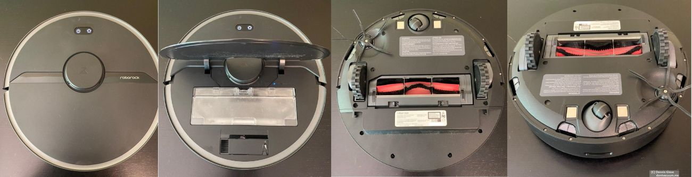

The Roborock S6 Pure is sold as:
- Roborock S6 Pure

#### Comments

**Important Note:** 
I do not own this robot. There can be unknown issues with equally unknown solutions. 
Not everything might work. The available firmware might be outdated. The experience might be subpar.

Rooting requires full disassembly.

#### Details

**Valetudo Binary**: `armv7-lowmem`

#### Rooting instructions

- [FEL](https://valetudo.cloud/pages/installation/roborock.html#fel)

### Roborock S4

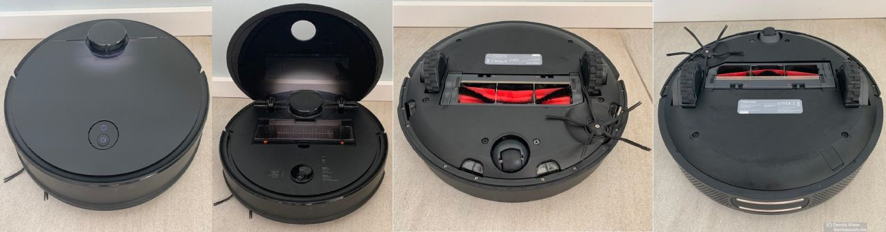

The Roborock S4 is sold as:
- Roborock S4

#### Comments

**Important Note:** 
I do not own this robot. There can be unknown issues with equally unknown solutions. 
Not everything might work. The available firmware might be outdated. The experience might be subpar.

Rooting requires full disassembly.

#### Details

**Valetudo Binary**: `armv7`

#### Rooting instructions

- [Vinda](https://valetudo.cloud/pages/installation/roborock.html#vinda)

### Roborock S4 Max

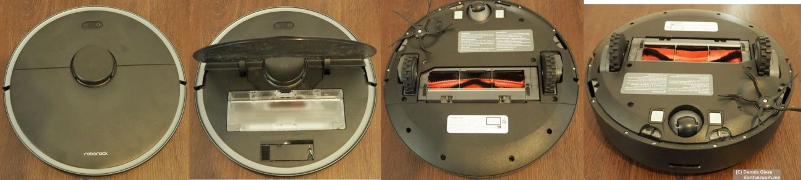

The Roborock S4 Max is sold as:
- Roborock S4 Max

#### Comments

**Important Note:** 
I do not own this robot. There can be unknown issues with equally unknown solutions. 
Not everything might work. The available firmware might be outdated. The experience might be subpar.

Rooting requires full disassembly.

#### Details

**Valetudo Binary**: `armv7-lowmem`

#### Rooting instructions

- [FEL](https://valetudo.cloud/pages/installation/roborock.html#fel)

### Roborock S5 Max

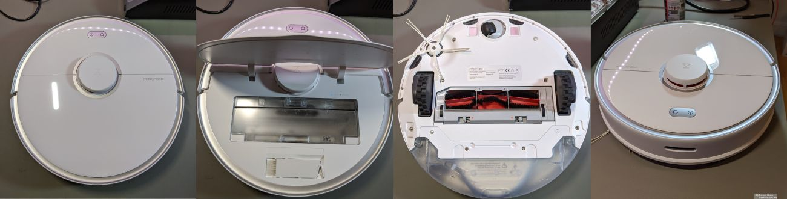

The Roborock S5 Max is sold as:
- Roborock S5 Max

#### Comments

Rooting requires full disassembly.

#### Details

**Valetudo Binary**: `armv7-lowmem`

#### Rooting instructions

- [FEL](https://valetudo.cloud/pages/installation/roborock.html#fel)

### Roborock S7

The Roborock S7 is sold as:
- Roborock S7
- Roborock S7+

#### Comments

Rooting requires full disassembly. 

**Warning:** 
The VibraRise mop module makes disassembly of this robot difficult and easy to mess up especially for newcomers.

#### Details

**Valetudo Binary**: `armv7-lowmem`

#### Rooting instructions

- [FEL](https://valetudo.cloud/pages/installation/roborock.html#fel)

### Roborock S7 Pro Ultra

The Roborock S7 Pro Ultra is sold as:
- Roborock S7 Pro Ultra

#### Comments

Rooting requires full disassembly.

#### Details

**Valetudo Binary**: `armv7-lowmem`

#### Rooting instructions

- [FEL](https://valetudo.cloud/pages/installation/roborock.html#fel)

### Roborock Q7 Max

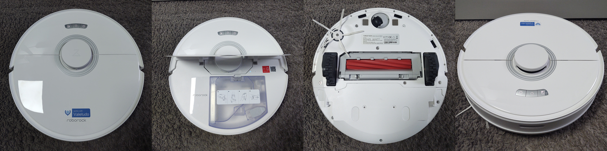

The Roborock Q7 Max is sold as:
- Roborock Q7 Max
- Roborock Q7 Max+

#### Comments

**2024-09-28 Update** 
Starting with robots manufactured somewhere around Q2 2024, Roborock switched to SkyHigh-brand NAND on their newly produced Q7 Max.
Unfortunately, after dumping quite a few days into it, we haven't been able to get the rooting procedure working with said NAND.

Thus, if you pick up a factory new Q7 Max then chances are that it's not rootable anymore.
The rooting procedure is still safe. It doesn't brick the robot; it just doesn't work.

You'll only find out that it's SkyHigh NAND once you've disassembled the robot and thus can't return it to the seller anymore.
Thus, right now your options are:
- Buying a used Q7 Max
- Buying from a seller that doesn't move much inventory still selling older Q7 Max
- Buying something else that is supported by Valetudo

Rooting requires full disassembly.

#### Details

**Valetudo Binary**: `armv7-lowmem`

#### Rooting instructions

- [FEL](https://valetudo.cloud/pages/installation/roborock.html#fel)

## Viomi

Viomi is a brand that uses existing robot designs with a slightly customized cloud. 
They're not a robot manufacturer.

### Viomi V6

The Viomi V6 is actually a 3irobotix CRL-200S inside. It is sold as:
- Viomi Cleaning Robot
- Viomi V2
- Viomi V2 Pro
- V-RVCLM21B

#### Comments

Rooting is pretty easy, only requiring a Linux Laptop and a micro USB cable. 
It might be required to remove the battery but that can be done without touching any warranty seals.

#### Details

**Valetudo Binary**: `armv7`

#### Rooting instructions

- [ADB](https://github.com/Hypfer/valetudo-crl200s-root)

### Viomi SE

The Viomi SE is actually a 3irobotix CRL-200S inside. It is sold as:
- Viomi SE
- V-RVCLM21A

#### Comments

Rooting is pretty easy, only requiring a Linux Laptop and a micro USB cable. 
It might be required to remove the battery but that can be done without touching any warranty seals.

#### Details

**Valetudo Binary**: `armv7`

#### Rooting instructions

- [ADB](https://github.com/Hypfer/valetudo-crl200s-root)

## Eureka

Eureka is a brand of Midea.

As of now (2025-08-29), support for these is experimental, beta, barely tested and full of dragons.
 
<a href="https://t.me/+F00lFE1NVUc2NTAy" data-si="34097f03527c7c0375540b07132a652161373c7c0c2f29446177627c62615d705318331a1b1c0b7a">Valetudo on Midea Telegram Group</a>

### Eureka J15 Pro Ultra

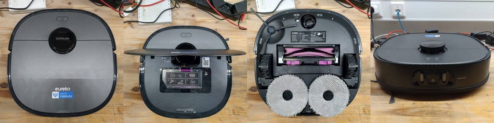

#### Comments

**WARNING** 

The public root for this model is **still pending** and in development. 
**DO NOT BUY THIS (YET)** if you're looking to use it with Valetudo.

#### Details

**Valetudo Binary**: `aarch64`

### Eureka J15 Ultra

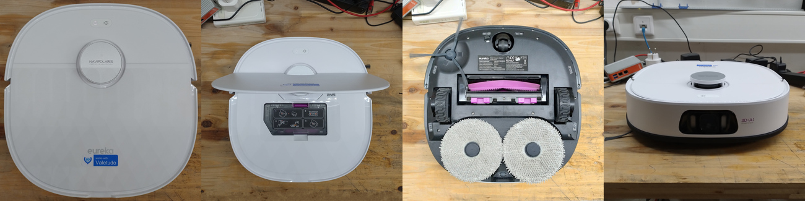

#### Comments

**WARNING** 

The public root for this model is **still pending** and in development. 
**DO NOT BUY THIS (YET)** if you're looking to use it with Valetudo.

#### Details

**Valetudo Binary**: `aarch64`

### Eureka J12 Ultra

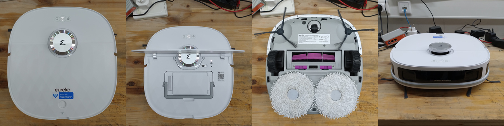

#### Comments

**WARNING** 

The public root for this model is **still pending** and in development. 
**DO NOT BUY THIS (YET)** if you're looking to use it with Valetudo.

#### Details

**Valetudo Binary**: `aarch64`

## Cecotec

Conga is a brand that uses existing robot designs with a slightly customized cloud. 
They're not a robot manufacturer. 

### Conga 3290

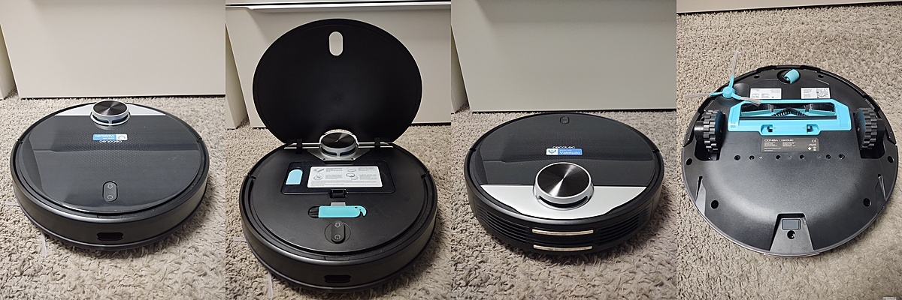

The Conga 3290 is actually a 3irobotix CRL-200S inside. It is sold as:
- Conga 3290

#### Comments

**Important note:** 
Because these use a non-miio cloud implementation, getting them to work with Valetudo means reflashing them to a Viomi V6.
That's possible, because the hardware is exactly the same.

Rooting is pretty easy, only requiring a Linux Laptop and a micro USB cable. 
It might be required to remove the battery but that can be done without touching any warranty seals.

#### Details

**Valetudo Binary**: `armv7`

#### Rooting instructions

- [ADB](https://github.com/Hypfer/valetudo-crl200s-root)

### Conga 3790

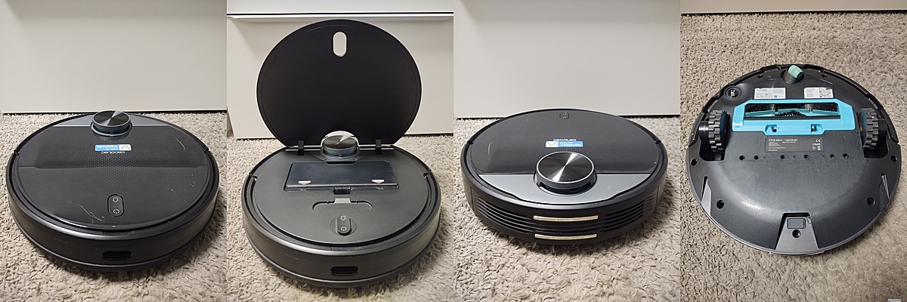

The Conga 3790 is actually a 3irobotix CRL-200S inside. It is sold as:
- Conga 3790

#### Comments

**Important note:** 
Because these use a non-miio cloud implementation, getting them to work with Valetudo means reflashing them to a Viomi V6.
That's possible, because the hardware is exactly the same.

Rooting is pretty easy, only requiring a Linux Laptop and a micro USB cable. 
It might be required to remove the battery but that can be done without touching any warranty seals.

#### Details

**Valetudo Binary**: `armv7`

#### Rooting instructions

- [ADB](https://github.com/Hypfer/valetudo-crl200s-root)

## Proscenic

Proscenic is a brand that uses existing robot designs with a slightly customized cloud. 
They're not a robot manufacturer. 

### Proscenic M6 Pro

The Proscenic M6 Pro is actually a 3irobotix CRL-200S inside. It is sold as:
- Proscenic M6 Pro

#### Comments

**Important note:** 
Because these robots use a non-miio cloud implementation, getting them to work with Valetudo means reflashing them to a Viomi V6.
That's possible, because the hardware is exactly the same.

Rooting is pretty easy, only requiring a Linux Laptop and a micro USB cable. 
It might be required to remove the battery but that can be done without touching any warranty seals.

#### Details

**Valetudo Binary**: `armv7`

#### Rooting instructions

- [ADB](https://github.com/Hypfer/valetudo-crl200s-root)

## Commodore

Someone from Austria seems to have bought the rights to use the long-defunct Commodore brand. 
Apparently, the first thing to do with that was to release a line of vacuum robots made by 3irobotix. 

### Commodore CVR 200

The Commodore CVR 200 is actually a 3irobotix CRL-200S inside. It is sold as:
- Commodore CVR 200

#### Comments

**Important note:** 
Because these robots use a non-miio cloud implementation, getting them to work with Valetudo means reflashing them to a Viomi V6.
That's possible, because the hardware is exactly the same.

Rooting is pretty easy, only requiring a Linux Laptop and a micro USB cable. 
It might be required to remove the battery but that can be done without touching any warranty seals.

#### Details

**Valetudo Binary**: `armv7`

#### Rooting instructions

- [ADB](https://github.com/Hypfer/valetudo-crl200s-root)

## IKOHS

I don't even know what this brand is. It doesn't seem to be around anymore? 
When it was around though, it of course released a branded CRL-200S.

### IKOHS Netbot LS22

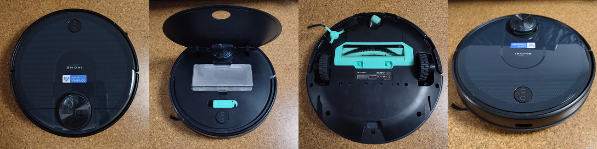

The IKOHS Netbot LS22 is actually a 3irobotix CRL-200S inside. It was sold as:
- IKOHS Netbot LS22

#### Comments

**Important note:** 
Because these robots use a non-miio cloud implementation, getting them to work with Valetudo means reflashing them to a Viomi V6.
That's possible, because the hardware is exactly the same.

Rooting is pretty easy, only requiring a Linux Laptop and a micro USB cable. 
It might be required to remove the battery but that can be done without touching any warranty seals.

#### Details

**Valetudo Binary**: `armv7`

#### Rooting instructions

- [ADB](https://github.com/Hypfer/valetudo-crl200s-root)
