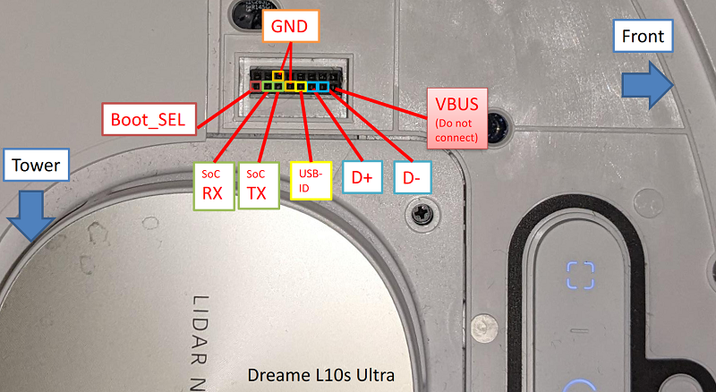
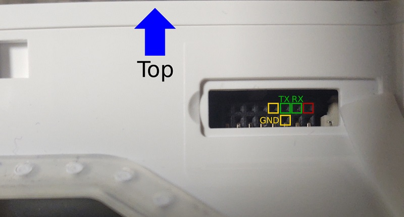
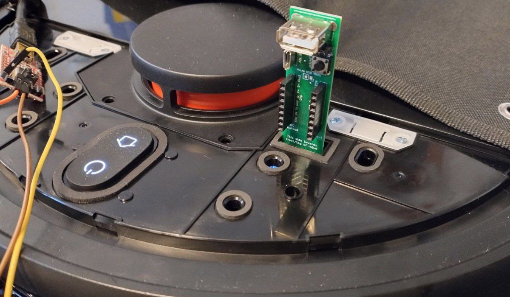
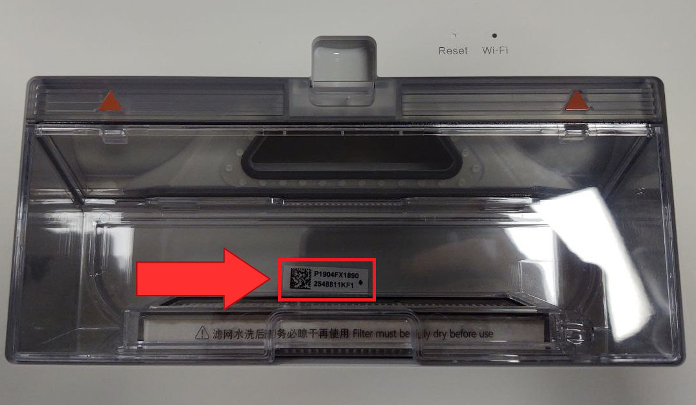
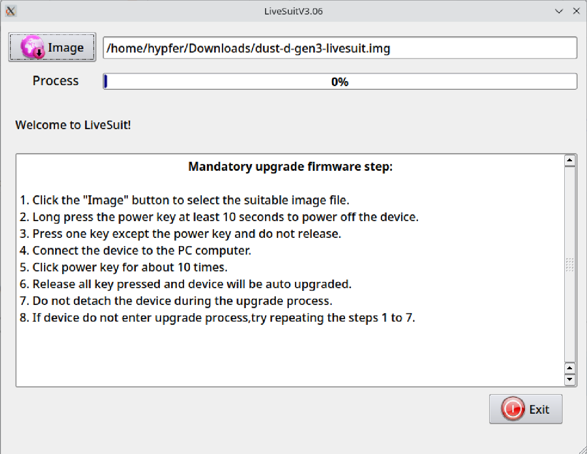
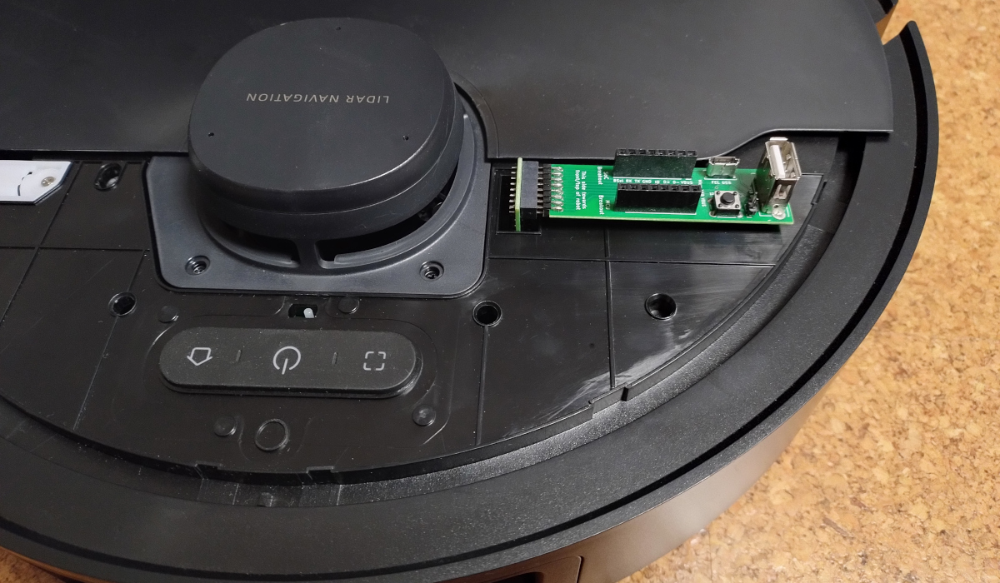
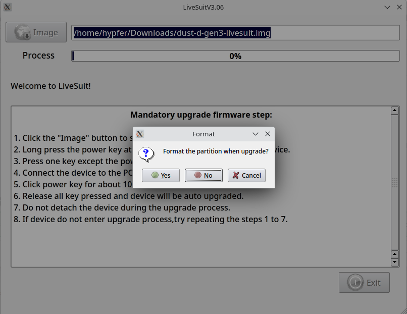
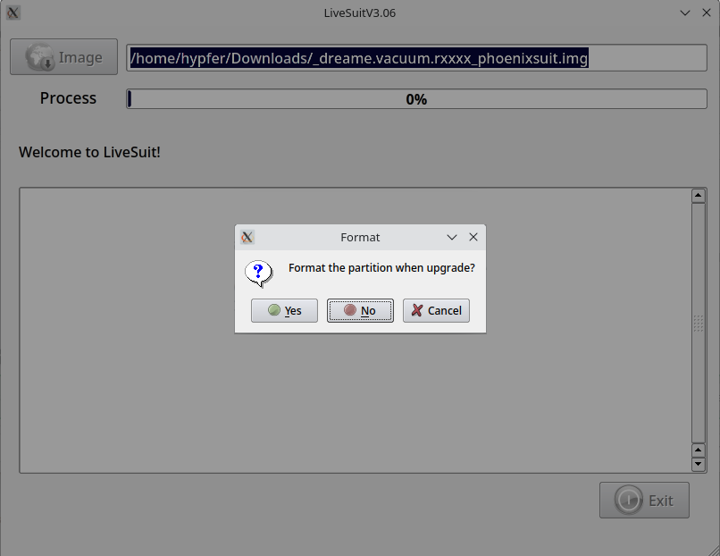

# Dreame rooting and installation

Please check the [supported robots](https://valetudo.cloud/pages/general/supported-robots.html) page to find out which method applies to your model of robot.

Also note that all rooting guides assume a factory-new robot that has never been connected to the vendor cloud.<br/>
If you've used any vendor apps before, make sure to do a full factory-reset before starting with the rooting procedure.

<div class="section-box" markdown="1">

## UART shell <a id="uart"></a>

To root using this method, you'll need:

- The [Dreame Breakout PCB](https://github.com/Hypfer/valetudo-dreameadapter)
- A 3.3V USB to TTL Serial UART Adapter (like CP2102 or Pl2303)
- A FAT32 & MBR-formatted USB Stick preferably with an activity LED
- Some dupont cables

Basic linux knowledge and a pry tool will help as well.

#### High-level overview

This rooting method works by using a nice debug feature Dreame left in the firmware:<br/>
In the stock firmware of p-dreames, there's a udev (well, mdev technically) rule that runs a script once it sees a new
block device appear in `/dev/sd[a-z][0-9]`. This script then proceeds to mount the filesystem on it and if successful spawns
a login shell on the UART accessible on the debug connector.

The root password is calculated from the serial number that can be found on a sticker on the robot and the debug
connector also provides access to USB-OTG-functionality. And that's **almost** it.

**Almost**, because on some p-dreames (check the [supported robots](https://valetudo.cloud/pages/general/supported-robots.html) page for more info), Dreame introduced a secure boot scheme 
with a key burned into the SoC that then verifies the signature of the U-Boot bootloader, which in turn verifies the signature of the rootfs etc.

On these robots, you **MUST** defeat the secure boot mechanism before making any modifications to the filesystem **or else you will brick your robot**.
Don't worry though as the `install.sh` script included in the firmware built using <a href="https://builder.dontvacuum.me" rel="noopener" target="_blank">the dustbuilder</a> will take care of that for you.

#### Note for advanced users

While the Dreame Breakout PCB greatly simplifies the process, it is not strictly _required_ but
just _highly recommended_ to avoid people breaking the connector by jamming in 2.54mm pitch cables or shorting 5V to something.<br/>

<details>
<summary>If you know what you're doing, here's the relevant pinout for you (click me)</summary>
<br/>

<br/>
On some dreames, the debug connector is rotated by 90°:<br/>

<br/>
while on others, it might be flipped backwards:<br/>

<br/>
<p>
If you <strong>don't</strong> know what you're doing and start bothering the support chat with questions on what to do with this pinout,
I will send you pictures of sad kittens. You have been warned.
</p>
</details>

<br/>

#### Phase 0: Preparation

<div class="alert alert-note" role="alert">
  <p>
    Before you do anything, if you've ever used the robot with the vendor app, make sure to factory-reset it first.
    <br/>
    For that, with the robot turned on, press and hold the button labelled "reset" next to the Wi-Fi LED until it talks to you.
</p>
</div>

To prepare the USB Stick used for rooting, just download [this zip archive](./res/dreame_uart_root_img.zip),
unzip it and flash the contained `.img` to the USB stick using e.g. `dd` or other tooling used to flash images to block devices.

While you can also just create an MBR-formatted 1-FAT32-partition USB stick on your own, rooting feedback has shown that
sometimes, things do go wrong, causing either no shell or multiple shells to spawn, which both prevents successful rooting.

Therefore, it's recommended to use this known-good image that has been tested on a real robot.

#### Phase 1: Connecting to the Robot

For this rooting method, you will first have to gain access to the 16-pin Dreame Debug Connector.
For all round-shaped dreames, this means removing the top plastic cover with a pry tool or your fingers like so:


If your Dreame is the P2148 Ultra Slim, just remove the whole top cover.<br/>
If your Dreame is a D-shaped Mop such as the W10, simply take out the dustbin and open the rubber flap in front of that port.

Once you have access to the debug port, plug in your [Dreame Breakout PCB](https://github.com/Hypfer/valetudo-dreameadapter) and then
connect your USB to Serial UART adapter to the SoC breakout on the PCB. **Make sure your adapter is set to 3.3V**.
You will only need 3 wires for this connection: (GND, RX, and TX).



#### Phase 2: Logging in

Now that you're all wired up, the next step is to open a serial connection to the device. For that, you can use screen: `screen /dev/ttyUSB0 115200,ixoff`.
Your user also needs to have permission to access `/dev/ttyUSB0` which usually either means being root or part of the `dialout` group.

Once your connection is ready, turn on the vacuum by pressing and holding the middle button (POWER) for at least 3 seconds.

You should see some logs and one of the last ones will say root password changed.
If you don't see any logs, try swapping RX and TX. If you instead see some random characters, check your cabling.

Ensure that the OTG ID Jumper on the breakout PCB is connected and insert your USB Stick.
If you don't have a jumper soldered, you can also use a jumper wire on the breakout header to connect ID OTG to GND.

After some flashing of the activity LED of your USB Stick, your UART connection should show a login prompt like `"p2029_release login”`.
Don't be confused about it not being `p2029` on your robot. `p2029` is just the model ID of the L10 Pro and thus will vary depending on the robot.

<div class="alert alert-tip" role="alert">
  <p>
    There are other processes running on the robot that write stuff to the terminal the shell is running on.
    You can ignore that output as it is purely visual and does not affect your shell. Just keep typing.
  </p>
</div>

For logging in, use the user `root`. It will then ask for a password.
To calculate the password use the full serial number of your robot, which can be found on the sticker below the dustbin.
**Not the one on the bottom of the robot nor the one on the packaging. You'll have to take out the dustbin and look below it into the now empty space.**



To get the password, use the following [Calculator](https://gchq.github.io/CyberChef/#recipe=Find_/_Replace(%7B'option':'Regex','string':'(%5C%5Cn%7C%5C%5Cr)'%7D,'',true,false,true,false)MD5()Find_/_Replace(%7B'option':'Regex','string':'$'%7D,'%20%20-%5C%5Cn',false,false,false,false)To_Base64('A-Za-z0-9%2B/%3D')&input=UDIwMDkwMDAwRVUwMDAwMFpN)
or enter the full SN (all uppercase) into this shell command
`echo -n "P20290000US00000ZM" | md5sum | base64`

If your Dreame is Xiaomi-branded, your SN might instead look similar to `41717/BFACWF3Z000000`.<br/>
In that case, use the full string including the `41717/` part as the SN.

#### Phase 3: Installing the patched Firmware + Valetudo

Once logged in, build a patched firmware image for manual installation via the [Dustbuilder](https://builder.dontvacuum.me).
**Make sure that both `Prepackage valetudo` and `Patch DNS` are selected before clicking on `Create Job`.**
You will receive an email once it's built. Download the `tar.gz` file from the link in that mail to your laptop.

With the `tar.gz` downloaded, head over to <a href="https://github.com/Hypfer/valetudo-helper-httpbridge" rel="noopener" target="_blank">https://github.com/Hypfer/valetudo-helper-httpbridge</a>
and download a matching binary for your laptops operating system.

Now, connect the laptop to the Wi-Fi Access Point of the robot. If you can't see the robots Wi-Fi AP to connect to, it might have disabled itself because 30 minutes passed since the last boot.
In that case, press and hold the two outer buttons until it starts talking to you.

The next step is to start the utility webserver. On Windows, a simple double-click on the exe should do the trick. **Don't close that window until you're done.**
The server will create a new `www` directory right next to itself as well as print out a few sample commands explaining how to download from and upload to it.

Make sure that it is listening on an IP in the range of `192.168.5.0/24` and then copy the downloaded `tar.gz` to the newly created `www` folder.

<div markdown="1" class="emphasis-box">
<div class="alert alert-important" role="alert">
  <p>
    <strong>Important:</strong><br/>
    Before you continue with the rooting procedure of your robot, please make sure to create a backup of your calibration and identity data to allow for disaster recovery.
</p>
</div>

The easiest way of doing this is by creating a tar archive of everything important and then uploading it to your laptop,
which at this point should be connected to the robots Wi-Fi AP.

To do that, head back to the UART shell and create a tar file of all the required files like so:

```
tar cvf /tmp/backup.tar /mnt/private/ /mnt/misc/ /etc/OTA_Key_pub.pem /etc/publickey.pem
```

Then, look at the output of the `valetudo-helper-httpbridge` instance you've started previously.
It contains an example curl command usable for uploading that should look similar to this one:

```
curl -X POST http://192.168.5.101:1337/upload -F 'file=@./file.tar'
```

Change the file parameter to `file=@/tmp/backup.tar`, execute the command and verify that the upload to your laptop
was successful. If everything worked out correctly, you should now see a backup.tar with a non-zero size in `www/uploads`.

If you're experiencing issues, make sure that you've specified the correct port.

</div>

After uploading the backup and storing it in a safe place, you can now download the firmware image file that you've
previously put in the `www` directory. `valetudo-helper-httpbridge` will tell you the correct command, which should look
similar to this:

```
wget http://192.168.5.101:33671/file.tar
```
The `file.tar` part will of course be different.

After downloading the firmware image tar to your working directory (`/tmp`), it should be untared: `tar -xvzf dreame.vacuum.pxxxx_fw.tar.gz`.
Now, make sure that the robot is docked and then run the newly extracted installation script: `./install.sh`.

The robot will install the rooted firmware image and then reboot **on its own**. Please be patient.

After the robot has finished the installation, you should see a new MOTD (message of the day) on your UART shell.
It should look similar to this:

```
built with dustbuilder (https://builder.dontvacuum.me)
Fri 04 Feb 2022 10:08:21 PM UTC
1099
```

If you see that MOTD, the rooting procedure was successful.

You now have a rooted Dreame vacuum robot running Valetudo.

Now continue with the [getting started guide](https://valetudo.cloud/pages/general/getting-started.html#joining_wifi).

</div>

<div class="section-box" markdown="1">

## Fastboot <a id="fastboot"></a>

This method abuses the proprietary Allwinner LiveSuit tool for Linux with somewhat hacked LiveSuit images.
Because of that, it's a bit janky. You will also need some advanced linux knowledge.

This Guide assumes that you have booted a fresh copy of Debian 13 Live with some kind of GUI (e.g. KDE).<br/>
Please use a native environment for this, as VMs will usually be troublesome.

<div class="alert alert-important" role="alert">
  <p>
    <strong>Important:</strong><br/>
    This method can permanently brick your robot if you're not careful.<br/>
    Make sure to fully read through the guide a few times before attempting the root.<br/>
    You need to understand what you're going to do before you start attempting to do it.
</p>
</div>

### High-level overview

This is a multi-staged rooting method, consisting of three phases:

1. First, we start with a recon phase, where we analyze the robot and the software on it to determine the right way to patch
out security features that would otherwise prevent the root.
2. Using the information gathered, in phase 2, we apply the necessary changes to the robot and flash a rooted firmware image.
3. Lastly, in phase 3, we install Valetudo to that rooted firmware.

### Phase 0: Preparation

<div class="alert alert-note" role="alert">
  <p>
    Before you do anything, if you've ever used the robot with the vendor app, make sure to factory-reset it first.
    <br/>
    For that, with the robot turned on, press and hold the button labelled "reset" next to the Wi-Fi LED until it talks to you.
</p>
</div>

#### Software preparation

For this root, you need to set up your Laptop with Debian and install livesuit on it. To do that, head over to
<a href="https://github.com/Hypfer/valetudo-sunxi-livesuit" rel="noopener" target="_blank">https://github.com/Hypfer/valetudo-sunxi-livesuit</a>
and follow the instructions in the readme.

You can of course use any linux distribution you want, however, if you want to receive support, please stick with Debian.

#### Gain access to the debug connector

Next, you have to gain access to the 16-pin Dreame Debug Connector.
For most round-shaped dreames, this means removing the top plastic cover with a pry tool or your fingers like so:


If your Dreame is a D-shaped Mop such as the W10 Pro, simply take out the dustbin and open the rubber flap in front of that port.

#### Note for advanced users

While the Dreame Breakout PCB greatly simplifies the process, it is not strictly _required_ but
just _highly recommended_ to avoid various pitfalls like using the wrong pitch and breaking the connector, shorting stuff etc.

Just remember that you will be running USB 2.0 at 480MBit/s over that connection. And, while some random unshielded untwisted
dupont cables might work for UART at 115200 baud, that UART connection is doing less than 1% of the data rate of USB 2.0.

Since high-speed protocols have far higher demands on signal integrity, the connection will likely either not work at all
or break down during data transfers, leading to confusion.

You should _really_ be using the PCB.

<details>
<summary>If you know what you're doing, here's the relevant pinout for you (click me)</summary>
<br/>

<br/>
On some dreames, the debug connector is rotated by 90°:<br/>

<br/>
while on others, it might be flipped backwards:<br/>

<br/>
<p>
If you <strong>don't</strong> know what you're doing and start bothering the support chat with questions on what to do with this pinout,
I will send you pictures of sad kittens. You have been warned.
</p>
</details>

<br/>

### Phase 1: Recon

As described in the high-level overview, we start by doing some reconnaissance on the robot.

#### Get the config value

Download the latest stage1 dustbuilder livesuit image for your robot:
- <a href="https://builder.dontvacuum.me/nextgen/dust-livesuit-mr813-ddr3.img" rel="noopener" target="_blank">D10s Pro/Plus, W10 Pro</a>
- <a href="https://builder.dontvacuum.me/nextgen/dust-livesuit-mr813-ddr4.img" rel="noopener" target="_blank">Everything else</a>

and select that as the Image in the LiveSuit tool.



Follow these steps to enter fastboot:

<div markdown="1" class="emphasis-box">
<strong>Entering fastboot</strong><br/>

Plug the Breakout PCB into your robot. Make sure that the USB OTG ID Jumper is **NOT** set and plug a cable into
the Micro USB port.




1. Press and hold the button on the PCB.
2. Then, press and hold the power button of the robot. Keep pressing the button on the PCB.
3. After 5s, release the power button of the robot.
4. Continue holding the button on the PCB for 3 additional seconds.

The button LEDs of the robot should now be pulsing. With that, plug the USB cable into your computer.
LiveSuit should now display this message box:



Click no. This should now have booted your robot into Fastboot.
To verify that, open a new terminal and run `fastboot devices`.
</div>

If you see your robot, continue with `fastboot getvar dustversion`

```
root@T420:/home/hypfer# fastboot devices 
Android Fastboot        fastboot 
root@T420:/home/hypfer# fastboot getvar dustversion 
dustversion: 2024.07.00 
Finished. Total time: 0.003s 
```

<div class="alert alert-important" role="alert">
  <p>
    Before you continue, make sure that the reported dustversion is at least 2024.07, as older versions of the stage1 image
    contain a super weird bug that can in some rare cases permanently brick the robot.
</p>
</div>

If everything is fine so far, next step is to collect the config value:

```
root@T420:/home/hypfer# fastboot getvar config 
config: 836064ae31f4806c844f708ab8398367 
Finished. Total time: 0.215s
```

This config value is important to select the correct bootloader patches and prevent bricks.<br/>
Write it down somewhere as you will also need it for updating the firmware in the future.

#### Further recon

For disaster recovery and to support us determine which changes are required for which config value, you will need to
sample about 0.8 to 1.2GB of data from the robot.

<div class="alert alert-tip" role="alert">
  <p>
    Depending on how fast you are with the terminal, the watchdog might reboot the robot mid-execution.
    At this stage of the guide, that is nothing to worry about. If it happens, just enter fastboot again and continue where you left off.
  </p>
</div>

To start sampling, execute `fastboot get_staged dustx100.bin`.<br/>
This will create a file named `dustx100.bin` in the current directory.

Ensure that it is about 400MB in size using `du -h dustx100.bin`.

```
root@T420:/home/hypfer# fastboot get_staged dustx100.bin 
Uploading 'dustx100.bin'                           OKAY [ 37.898s] 
Finished. Total time: 37.898s 
root@T420:/home/hypfer# du -h dustx100.bin  
400M    dustx100.bin 
```

If it is, continue to the next step with `fastboot oem stage1` and `fastboot get_staged dustx101.bin`

```
root@T420:/home/hypfer# fastboot oem stage1 
                                                   OKAY [  0.000s] 
Finished. Total time: 0.000s 
root@T420:/home/hypfer# fastboot get_staged dustx101.bin 
Uploading 'dustx101.bin'                           OKAY [ 38.173s] 
Finished. Total time: 38.173s 
root@T420:/home/hypfer# du -h dustx101.bin  
399M    dustx101.bin 
```

Once done, again check the filesize using `du -h dustx101.bin`.<br/>
As you can see in the example, it being only 399MB is okay. It should be _around_ 400MB.

Then, finally, run `fastboot oem stage2` and `fastboot get_staged dustx102.bin`

```
root@T420:/home/hypfer# fastboot oem stage2 
                                                   OKAY [  0.000s] 
Finished. Total time: 0.000s 
root@T420:/home/hypfer# fastboot get_staged dustx102.bin 
Uploading 'dustx102.bin'                           OKAY [ 37.992s] 
Finished. Total time: 37.992s 
root@T420:/home/hypfer# du -h dustx102.bin  
399M    dustx102.bin 
```

Same check for being ~400MB in size applies here as well.

With that done, zip up everything and store the file in a safe place

```
root@T420:/home/hypfer# zip dreame_rxxxx_samples.zip dustx100.bin dustx101.bin dustx102.bin  
  adding: dustx100.bin (deflated 0%) 
  adding: dustx101.bin (deflated 0%) 
  adding: dustx102.bin (deflated 0%) 
root@T420:/home/hypfer# du -h dreame_rxxxx_samples.zip  
1.2G    dreame_rxxxx_samples.zip
```

#### Build the firmware image

Because there's a hardware watchdog that will reset your robot and the dustbuilder firmware build takes some time,
press and hold the power button for 15s to turn off the robot for now. Also, unplug the USB cable from your laptop.<br/>
If you don't do this, you risk bricking the device if it gets rebooted during the install procedure.

Now that you have the correct config value for your robot, head over to <a href="https://builder.dontvacuum.me" rel="noopener" target="_blank">the dustbuilder</a>
and build a new firmware for your robot. Make sure to select `Create FEL image (for initial rooting via USB)`.

<div class="alert alert-warning" role="alert">
  <p>
    If building a firmware fails with "Error: invalid config value.", unfortunately, your rooting process has to be paused for now.<br/>
    Take the zip file created in the previous step, head over to <a href="https://check.builder.dontvacuum.me/">https://check.builder.dontvacuum.me/</a> and upload it there.<br/>
    We will then look into what is required for your config value.
    <br/><br/>
    Be aware that it may take some time, as we do that in our free time beside working regular jobs and having other life things going on.
    You will know that it is done once the dustbuilder doesn't reject your config value anymore.<br/>
    Thank you for being patient.
  </p>
</div>

### Phase 2: Rooting

Now that we know everything we need to know, we can continue with flashing the rooted firmware image.

#### Prepare for rooting

Once the firmware build has finished, download your `dreame.vacuum.rxxxx_xxxx_fel.zip` to the laptop and unpack it.
Navigate the second terminal for fastboot into the folder containing the contents of that zip file.

Close LiveSuit and open it again.

Select the newly generated image from the zip named `_dreame.vacuum.rxxxx_phoenixsuit.img`.
Open the `check.txt` and copy the content into your clipboard.

Using that newly generated image(!) enter fastboot once more.
Remember that once in fastboot, you will have **160s to finish the procedure** before the watchdog reboots the system,
leaving it in a possibly bricked state.

Here are the steps again:

<div markdown="1" class="emphasis-box">
<strong>Entering fastboot</strong><br/>

Plug the Breakout PCB into your robot. Make sure that the USB OTG ID Jumper is **NOT** set and plug a cable into
the Micro USB port.


1. Press and hold the button on the PCB.
2. Then, press and hold the power button of the robot. Keep pressing the button on the PCB.
3. After 5s, release the power button of the robot.
4. Continue holding the button on the PCB for 3 additional seconds.

The button LEDs of the robot should now be pulsing. With that, plug the USB cable into your computer.
LiveSuit should now display this message box:



Click no. This should now have booted your robot into Fastboot.
To verify that, open a new terminal and run `fastboot devices`.
</div>

#### Root the robot

Once the robot is back in fastboot, run `fastboot getvar config` to start the procedure.

Then, run `fastboot oem dust <value>` with `<value>` being the one you've copied from the `check.txt`.<br/>
Fastboot should confirm this action with `OKAY`. If it doesn't, **DO NOT PROCEED**.

Next step is to run `fastboot oem prep`.<br/>
Fastboot should confirm this action with `OKAY`. If it doesn't, **DO NOT PROCEED**.

Next step is `fastboot flash toc1 toc1.img`.<br/>
Fastboot should confirm this action with `OKAY`. If it doesn't, **DO NOT PROCEED**.


With that done, secure boot should be defeated. But rooting isn't done and the timer is still ticking.
Continue by flashing the boot and rootfs partitions.

```
fastboot flash boot1 boot.img
fastboot flash rootfs1 rootfs.img

fastboot flash boot2 boot.img
fastboot flash rootfs2 rootfs.img
```

This can take a few seconds and may also print an error message like `Invalid sparse file format at header magic`.
You can just ignore that one.<br/>
**BUT** as with the commands above, fastboot should confirm all of this with `OKAY`. If it doesn't, **DO NOT PROCEED**.


Finally, run `fastboot reboot`. If it boots up normally, you have successfully rooted your robot.

### Phase 3: Install Valetudo

With the rooted firmware installed, we finish the procedure by installing Valetudo to it.

For that, first, check the [Supported Robots](https://valetudo.cloud/pages/general/supported-robots.html) page and look up which `Valetudo Binary` is the right one for your robot.

Once you know that, download the latest matching Valetudo binary to your laptop:
`https://github.com/Hypfer/Valetudo/releases/latest/download/valetudo-{armv7,armv7-lowmem,aarch64}`

With the Valetudo binary downloaded, head over to <a href="https://github.com/Hypfer/valetudo-helper-httpbridge" rel="noopener" target="_blank">https://github.com/Hypfer/valetudo-helper-httpbridge</a>
and download a matching binary for your laptops operating system.

Now, connect the laptop to the Wi-Fi Access Point of the robot. If you can't see the robots Wi-Fi AP to connect to, it might have disabled itself.
In that case, press and hold the two outer buttons until it starts talking to you.

Once connected via Wi-Fi, you should be able to connect to it using ssh. Do that now and keep the shell open: `ssh -i ./your/keyfile root@192.168.5.1`

The next step is to start the utility webserver. Open a new terminal and run the `./valetudo-helper-httpbridge-amd64` binary **Don't close that window until you're done.**
The server will create a new `www` directory right next to itself as well as print out a few sample commands explaining how to download from and upload to it.

Make sure that it is listening on an IP in the range of `192.168.5.0/24` and then copy the downloaded valetudo binary to the newly created `www` folder.
Remove the `{-aarch64,lowmem,..}` etc. suffix. It should just be called `valetudo`.

<div markdown="1" class="emphasis-box">
<div class="alert alert-important" role="alert">
  <p>
    <strong>Important:</strong><br/>
    Before you continue with the rooting procedure of your robot, please make sure to create a backup of your calibration and identity data to allow for disaster recovery.
</p>
</div>

The easiest way of doing this is by creating a tar archive of everything important and then uploading it to your laptop,
which at this point should be connected to the robots Wi-Fi AP.

To do that, use the ssh shell to create a tar file of all the required files like so:

```
tar cvf /tmp/backup.tar /mnt/private/ /mnt/misc/
```

Then, look at the output of the `valetudo-helper-httpbridge` instance you've started previously.
It contains an example curl command usable for uploading that should look similar to this one:

```
curl -X POST http://192.168.5.101:1337/upload -F 'file=@./file.tar'
```

Change the file parameter to `file=@/tmp/backup.tar`, execute the command and verify that the upload to your laptop
was successful. If everything worked out correctly, you should now see a backup.tar with a non-zero size in `www/uploads`.

If you're experiencing issues, make sure that you've specified the correct port.

</div>

After uploading the backup and storing it in a safe place, you can now download the valetudo binary that you've
previously put in the `www` directory. `valetudo-helper-httpbridge` will tell you the correct command, which should look
similar to this:

```
wget http://192.168.5.101:1337/valetudo
```

After downloading the Valetudo binary, finish the install by running these commands on the robot:
```
mv /tmp/valetudo /data/valetudo
chmod +x /data/valetudo
cp /misc/_root_postboot.sh.tpl /data/_root_postboot.sh
chmod +x /data/_root_postboot.sh

reboot
```

Once the robot has rebooted, you can continue with the [getting started guide](https://valetudo.cloud/pages/general/getting-started.html#joining_wifi).

</div>
