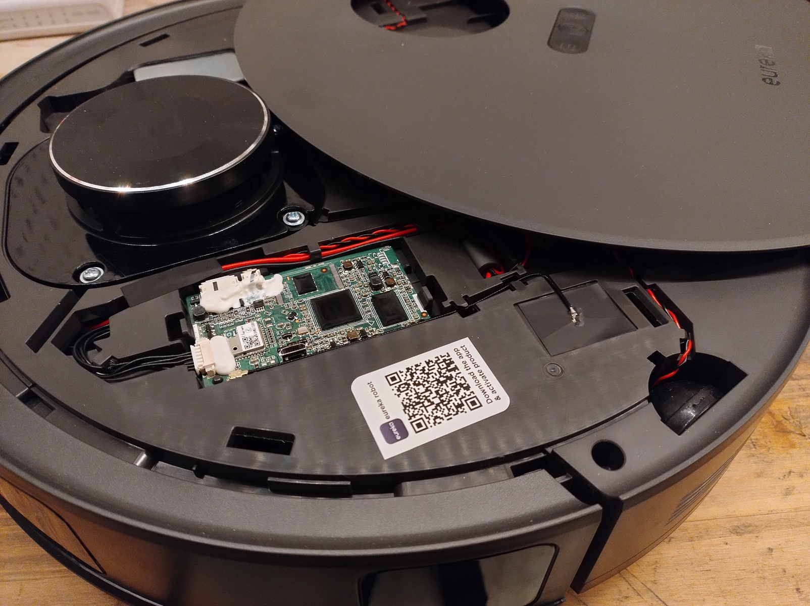

# Midea rooting and installation

Please check the [supported robots](https://valetudo.cloud/pages/general/supported-robots.html) page to find out which method applies to your model of robot.

Also note that all rooting guides assume a factory-new robot that has never been connected to the vendor cloud.<br/>
If you've used any vendor apps before, make sure to do a full factory-reset before starting with the rooting procedure.

<div class="section-box" markdown="1">

## ADB <a id="adb"></a>

This Guide assumes that you have booted a fresh copy of Debian 13 Live with some kind of GUI (e.g. KDE) on your laptop.<br/>
Please use a native environment for this, as VMs will usually be troublesome.

<div class="alert alert-important" role="alert">
  <p>
    <strong>Important:</strong><br/>
    This method can permanently brick your robot if you're not careful.<br/>
    These robots aren't exactly resilient or recoverable.<br/>
    Make sure that you understand what you're doing before doing it.
</p>
</div>

Depending on the model, dock and robot communicate via BLE and need to be paired and connected while flashing.<br/>
For rooting you will therefore need a laptop and sit down with it next to the dock housing the docked robot.

### High-level overview

The path to Valetudo here is actually remarkably simple:

1. We get a shell through either:
   1. The happy path
   2. The unhappy path
2. We push a custom update package onto the robot
3. We install that package by running the install script over and over again until it deletes itself


### Step 0: Finding the Micro USB port

To start with the root, you will first need to find out where to connect to the robot.
Regardless of model, this will require some plastic Pry Tool. I'm personally using some cheap AliExpress Kit for Car Trim Parts.

Armed with your trusty injection-molded crowbar, the path to the port will be one of these:




### Step 1: Determining the path

With the port located, the next step is to plug it in and run `adb shell`.

After typing in `root` as the username, you should see one of the following:

```
midea login: root
OTP Password:
```

or

```
midea login: root
Password:
```


If you're seeing `OTP Password:`, then you're on the happy path. Otherwise, it's the unhappy path.

### Step 2: Building the update package

Before you continue with the next steps, build an update package for manual installation via the <a href="https://builder.dontvacuum.me" rel="noopener" target="_blank">Dustbuilder</a>.
**Make sure that both `Prepackage valetudo` and `Patch DNS` are selected before clicking on `Create Job`.**

You will receive an email once it's built. Download the `tar.gz` file from the link in that mail to your laptop.

With the `tar.gz` downloaded, head over to <a href="https://github.com/Hypfer/valetudo-helper-httpbridge" rel="noopener" target="_blank">https://github.com/Hypfer/valetudo-helper-httpbridge</a>
and download a matching binary for your laptop's CPU architecture.

This will later be used to transfer the update package to your robot.

### Step 3.1: The happy path

If you saw `OTP Password:`, the next step is to run `dmesg` and look for output looking like this:

```
[ 4479.875489] usb 1-4: new high-speed USB device number 11 using xhci_hcd
[ 4480.016640] usb 1-4: New USB device found, idVendor=2207, idProduct=0019, bcdDevice= 3.10
[ 4480.016658] usb 1-4: New USB device strings: Mfr=1, Product=2, SerialNumber=3
[ 4480.016665] usb 1-4: Product: robot
[ 4480.016670] usb 1-4: Manufacturer: world
[ 4480.016674] usb 1-4: SerialNumber: 243f6a8885a308d3
[ 4480.020308] cdc_acm 1-4:1.1: ttyACM0: USB ACM device
```

Then, use the SerialNumber with this nifty calculator:



You should then be able to login as root with the password calculated for your device.<br/>
Remember that the robot needs to be factory-reset for it to work.

Additionally, the robot should be sitting in its dock.

By pressing and holding the Wi-Fi config button of the robot for a few seconds and then letting go, the robot will spawn
a Wi-Fi AP you need to connect your laptop to.

The Wi-Fi config button will either be a dedicated button or share a button with the "Spot Cleaning" function.
If the AP needs a password, use `12345678`.

### Step 3.2 The unhappy path

On robots where you just get a `Password:` prompt, things are a bit more hacky.<br/>
Here, we need to exploit a race condition in an init script to spawn a `telnetd` to eventually get a shell.

First, you will need to create two files:
```
echo -n "LMAO" > test.mod

echo "#!/bin/sh" > payload.sh
echo "/bin/busybox telnetd -l /bin/sh -p 1337 &" >> payload.sh

chmod +x payload.sh
```

Then, while connected via microUSB to the turned-off robot, start the loop:
```
while true; do adb push test.mod /oem/test.mod; adb push payload.sh /userdata/echo_pcbatest_server; done
```

On my J12 I've noticed that dock pairing can be a bit fragile and fiddly. There, I recommend booting the robot
not by pressing the power button but by unplugging the dock, docking the robot, then replugging the dock into the wall to make the robot boot up.<br/>
You might have to repeat this dance a few times during the rooting procedure.

On the E20 robots, no such dance is necessary.
Just turn it on.

Once you hear the boot-up sound, you can `Ctrl + C` the loop.


By pressing and holding the Wi-Fi config button of the robot for a few seconds and then letting go, the robot will spawn
a Wi-Fi AP you need to connect your laptop to.

The Wi-Fi config button will either be a dedicated button or share a button with the "Spot Cleaning" function.
If the AP needs a password, use `12345678`.


Once connected, in a new terminal, you can then get a shell using:
```
telnet 10.201.126.1 1337
```

### Step 4: Transfer

With shell access and the laptop connected to the Wi-Fi AP of the robot, in another terminal, run the httpbridge helper utility webserver.

The server will create a new `www` directory right next to itself as well as print out a few sample commands explaining how to download from and upload to it.
They will look somewhat like this:
```
wget http://10.201.126.2:1337/midea.j15u_fw.tar.gz
```

Now, put your update package into the `www` folder.

Switch back to the shell on the robot, `cd` into `/tmp`, and then download the `tar.gz` from the laptop to the robot by adapting the aforementioned sample commands.

### Step 5: Install

Because we cannot use the _normal_ process for OTA updates as those rely on the cloud, we need to make use of debug tooling.
This makes the process a bit inelegant, as the robot might need to reboot multiple times during the procedure.

The install script does take over all of the thinking though, so it's just a matter of running it a bunch of times.

For the initial run, use this one-liner:
```
tar xvf midea.*_fw.tar.gz && rm -f midea.*_fw.tar.gz && chmod +x ./install.sh && ./install.sh
```

The installer will then copy itself to `/userdata/dust_update/` and relaunch from there.
From there on, just follow what it tells you to do and relaunch it after every reboot up until it deletes itself.

After the first reboot, you relaunch it by running:
```
/userdata/dust_update/install.sh
```

Eventually, Valetudo will be installed and you can continue with the [getting started guide](https://valetudo.cloud/pages/general/getting-started.html#joining_wifi).


</div>
