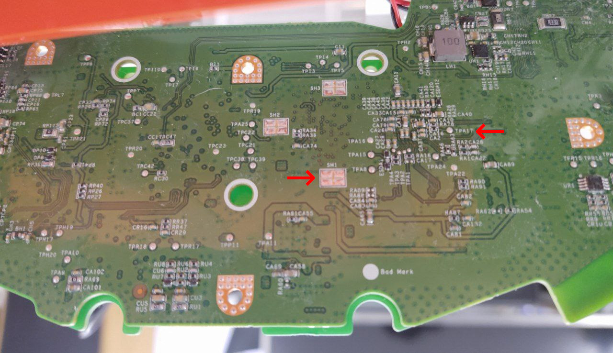

# Roborock rooting and installation

Please check the [supported robots](https://valetudo.cloud/pages/general/supported-robots.html) page to find out which method applies to your model of robot.

Also note that all rooting guides assume a factory-new robot that has never been connected to the vendor cloud.<br/>
If you've used any vendor apps before, make sure to do a full factory-reset before starting with the rooting procedure.

<div class="section-box" markdown="1">

## OTA <a id="ota"></a>

The ***O**ver-**t**he-**A**ir[-Update]* rooting method is the easiest one requiring no disassembly nor attaching any cables.
However, since Xiaomi disabled local OTA in newer versions of the `miio_client` (> 3.3.9), you might need to downgrade your firmware by factory resetting your robot.

Unfortunately, robots made after 2020-03 come with a non-local-OTA capable recovery firmware version so for those robots
you will need to follow the instructions below.

This works by using the official OTA update mechanism to push a customized (rooted + valetudo) firmware image to the robot.
It will happily accept that, because they aren't signed. For more information, check out the talk
[Unleash your smart-home devices: Vacuum Cleaning Robot Hacking](https://media.ccc.de/v/34c3-9147-unleash_your_smart-home_devices_vacuum_cleaning_robot_hacking).


First, make sure to do a full factory reset before continuing with the guide or else the installation will likely fail.
See [https://github.com/dgiese/dustcloud/wiki/Xiaomi-Vacuum-Robots-Factory-Reset](https://github.com/dgiese/dustcloud/wiki/Xiaomi-Vacuum-Robots-Factory-Reset) for instructions on how to do that.

### Building the Firmware Image

To build the firmware, head over to the [Dustbuilder](https://builder.dontvacuum.me/) and request a rooted firmware image for your specific robot.
Make sure to select the `Build update package (for installation via local OTA)` option.

### Flashing the firmware image

To flash the rooted firmware `.pkg`, there's an all-in-one tool that just does the right thing:
[valetudo-helper-miioota](https://github.com/Hypfer/valetudo-helper-miioota).

Just download the binary from the releases section, connect your laptop to the robots Wi-Fi access point and use it to install the `.pkg`.
A successful run should look similar to this:

```
./valetudo-helper-miioota install-firmware v11_2034.pkg 
Starting installer.
If you experience issues, make sure to disable your firewall and/or VPN.
Also, make sure that the robot is docked during the firmware update procedure.
If the install still fails, try turning the robot off and back on again and/or moving the laptop closer to it.

Robot discovery started...
Scan done.
Successfully discovered robot at 192.168.8.1
Reading firmware image..
Successfully read firmware image. Size: 78.62 MiB MD5Sum: fe820a713ec9efdfa3990b5d776e2cda

Listing for firmware download requests on http://192.168.8.10:34505/firmware
Response from robot: [ 'ok' ]
Received firmware download request from ::ffff:192.168.8.1..

Download seems to have finished.
The robot should now install the firmware. It will take 5-10 minutes.
Exiting..
```

Please keep the distance between your WiFi antenna and your robot as short as possible or the connection might get lost.

After the successful transfer of the image to the robot, the robot will start flashing the image. This will take about 5~10 minutes.
After the process is done, the robot will state that the update was successful.

You can now return to the [getting started guide](https://valetudo.cloud/pages/general/getting-started.html#joining_wifi).

#### Troubleshooting

* Firewall active? - Disable your personal firewall.
* Using a VM to flash the image? - Try to flash the image from your Host
* Your PC does not know how to route, is more than one network interfaces active? Maybe disable LAN?
* Are you sure that you're running an OTA-rootable firmware? If not, try doing a full factory reset
* Distance between WiFi devices is to big. Try putting the robo near your PC.
* Battery is lower than 20%. Please Charge. Place the Vacuum in the dock.

</div>
<div class="section-box" markdown="1">

## Vinda <a id="vinda"></a>

The vinda file method unfortunately requires full disassembly of the robot as well as soldering some wires which will
void your warranty.

In short, there's a file called `vinda` which contains the root password XOR'd with `0x37`.
By dropping into the u-boot shell, you can use the `ext4load` u-boot command usually used for loading a kernel to load
that file into memory and therefore read out the root password.

Then, you simply use an interactive shell via UART to achieve persistence.

Dennis made two videos explaining both disassembly as well as the actual root procedure.
They can be found here: [https://www.youtube.com/playlist?list=PL9PoaNtZCJRZc61c792VCr_I6jQK_IdSb](https://www.youtube.com/playlist?list=PL9PoaNtZCJRZc61c792VCr_I6jQK_IdSb)

Don't be confused by the Video not mentioning your particular robot model.
It's the same procedure for all robots listed here.

Also, your robot might come with a newer firmware, which doesn't feature a `vinda` file.
In that case, you'll need to follow the instructions below.

</div>
<div class="section-box" markdown="1">

## Init override <a id="init"></a>

For robots/firmwares without a `vinda` file, the approach here is to drop into the u-boot shell and edit the
kernel commandline so that `init` becomes `/bin/sh` which also gives you a rootshell, but requires you to quickly do some
initializing, because otherwise the hardware watchdog will reboot the robot.

Furthermore, due to limited storage, the new firmware is actually streamed onto the device.

The disassembly process plus the testpoints used are the same as the vinda method above so make sure to watch those videos
before attempting this.

The procedure is documented here: [https://builder.dontvacuum.me/x6cheatsheet.txt](https://builder.dontvacuum.me/x6cheatsheet.txt)

</div>
<div class="section-box" markdown="1">

## FEL rooting <a id="fel"></a>

<div class="alert alert-warning" role="alert">
  <p>
    <strong>Important:</strong><br/>
    This rooting method is not suited for beginners.<br/>
    If you're inexperienced in linux, hardware, etc., please ask a friend with more experience for help.
</p>
</div>

Essentially, this method works by booting a live linux image that patches the rootfs on the robot to enable ssh access and then utilize that to install a full rooted firmware image.

While it does not require soldering any wires, the way we get the SoC to let us boot from that live image requires pulling TPA 17 low, which is a test point found
on the underside of the robots mainboard. This means that full disassembly including destruction of all warranty seals is required.

For more in-depth information, check out [Dennis' talk at DEF CON 29](https://youtu.be/EWqFxQpRbv8?t=832).

For this root you will need:
* One of the listed NAND-based roborock vacuum robots
* A laptop running linux **natively** with `sunxi-tools` >= 1.3 installed
* A micro USB cable
* A few screwdrivers
* A jumper wire or a conductive paperclip
* A way to keep track of a lot of different screws


<div class="alert alert-note" role="alert">
  <p>
    Before you do anything, make sure that the robot is fully charged as all rooting will be done on battery power.<br/>
    Also, make sure to take pictures during every step of the disassembly to keep track of the order, which screw goes where and how cables should be routed.<br/>
    <br/>
    Depending on your experience, this procedure will take 1-2 hours. Take your time.
</p>
</div>


First, head over to the [Dustbuilder](https://builder.dontvacuum.me/) and request a rooted firmware image for your specific robot.
Make sure to select the `Create FEL image (for initial rooting via USB)` option.

Next, download the latest [valetudo-armv7-lowmem.upx binary](https://github.com/Hypfer/Valetudo/releases/latest/download/valetudo-armv7-lowmem.upx).


With the dustbuilder now building your image, you can start the disassembly of the robot until you reach the mainboard.
If you need help on how to do that, there fortunately are a few videos on YouTube.
Just search for e.g., "s5 max disassembly".

<div class="alert alert-important" role="alert">
  <p>
    <strong>Important:</strong><br/>
    Only disassemble what you absolutely have to disassemble to get to the mainboards underside.<br/>
    Every part you disassemble is a part that could be reassembled incorrectly leading to trouble with the robot.
</p>
</div>

You likely won't have to disconnect all the wires going to the mainboard.
It's enough to disconnect the ones at the front to be able to lift it in a position like this:


By the time you've reached the mainboard, you should've already received a link to download your rooted firmware package from the dustbuilder.

Click on the link and download both the zip and the tar.gz. Those should look similar to this:
```
roborock.vacuum.s5e_1566_fel.zip	2022-12-02 15:11 	4.8M
roborock.vacuum.s5e_1566_fw.tar.gz	2022-12-02 15:08 	26M
```


Now, connect your USB Cable to the robot and your Laptop running Linux.
Then, connect the battery. Do not turn on the robot yet.



Connect the marked TPA17 to GND using your jumper cable or paperclip. You can use anything that is GND.
The marked SH1 for GND should be close enough to enable you to do the procedure without the help of another person.
There might be some conformal coating on TPA17. You can use your fingernails to carefully scrape that off.

Press the power button for 3 seconds and keep the TPA17 connected to GND for 5 more seconds after that.

Now, check that it was successful by running `lsusb`. You should see the following:
```
Bus 001 Device 014: ID 1f3a:efe8 Allwinner Technology sunxi SoC OTG connector in FEL/flashing mode
```

If you don't see that, turn off the robot and try again.
It might be tricky to hold a steady connection while pressing the power button. Consider asking a friend for help.


With the robot showing up on USB as `Allwinner Technology sunxi SoC OTG connector in FEL/flashing mode`, unpack the zip
file, become root enter the directory containing the zips contents and execute the included `run.sh`.

It should look like this:
```
root@crozier:/home/hypfer/playground/roborock/s5e# ./run.sh
waiting for 3 seconds
100% [================================================]   852 kB,  152.2 kB/s
100% [================================================]    66 kB,  162.1 kB/s
100% [================================================]     0 kB,   93.2 kB/s
100% [================================================]  3647 kB,  153.6 kB/s
root@crozier:/home/hypfer/playground/roborock/s5e#
```

Watch the robots' LEDs. It should reboot after a while. It won't play any sounds as the speaker will likely be unplugged.

After that, connect your laptop to the Wi-Fi AP hosted by the robot. It should be named somewhat similar to `roborock-vacuum-s5e_miapFDD5`.

If it's a used robot, you might not see an AP. In that case, press and hold the two outer buttons until you see the Wi-Fi LED change.
It should then spawn the AP again.


After you've connected to the AP, first `ssh` into it:
```
ssh -i ./your_keyfile root@192.168.8.1
```

Now, create a backup of `/dev/nandb` and `/dev/nandk` like so:
```
dd if=/dev/nandb | gzip > /tmp/nandb.img.gz
dd if=/dev/nandk | gzip > /tmp/nandk.img.gz
```

These two flash partitions contain the factory calibration and identity data which is unique for each robot and can't
be recovered without a backup if data loss should ever occur.

Disconnect or open a second terminal and pull those backups to your laptop via `scp` and store them in a safe place:
```
scp -O -i ./your_keyfile root@192.168.8.1:/tmp/nand* .
```

**Note**:<br/>
If you're using an older version of openssh, you need to remove the `-O` flag from the command.

If you've used your robot extensively before rooting and/or bought a used unit, your data partition will likely contain
a lot of cleanup logs, preventing you from storing the firmware update package on it.

To free up some space, simply run
```
rm -rf /mnt/data/rockrobo/rrlog/*
```

Then, push the full rooted firmware image tar to the correct location on the robot using `scp`:
```
scp -O -i ~/.ssh/your_keyfile Downloads/roborock.vacuum.s5e_1566_fw.tar.gz root@192.168.8.1:/mnt/data/
```

Back on the robot via `ssh`, run these:
```
cd /mnt/data/
tar xvzf roborock.vacuum.s5e_1566_fw.tar.gz
./install.sh

reboot
```

After the reboot, reconnect to the robots' Wi-Fi AP and run the `./install.sh` again like this:
```
cd /mnt/data/
./install.sh

reboot
```

Once again wait for it to reboot and reconnect to the robots' Wi-Fi AP.

Push the downloaded Valetudo binary to the robot using `scp`. Note that there is no trailing slash in the sample command,
as `/mnt/data/valetudo` must be the binary itself and **not** a folder containing the binary.
```
scp -O -i ~/.ssh/your_keyfile Downloads/valetudo-armv7-lowmem.upx root@192.168.8.1:/mnt/data/valetudo
```

Connect to the robot via `ssh`. You will now clean up the installer files and setup valetudo to autostart on boot:
```
cd /mnt/data
rm roborock.vacuum.*.gz boot.img firmware.md5sum rootfs.img install.sh

cp /root/_root.sh.tpl /mnt/reserve/_root.sh
chmod +x /mnt/reserve/_root.sh /mnt/data/valetudo

reboot
```

After the robot has rebooted, connect to its Wi-Fi AP for the final time, wait for a minute or two and then open the
Valetudo Webinterface in your browser to connect the robot to your Wi-Fi network.<br/>
For that, just browse to `http://192.168.8.1`.

After reassembling the robot you can continue with the <a href="https://valetudo.cloud/pages/general/getting-started.html#using-valetudo">getting started guide</a>.

</div>
