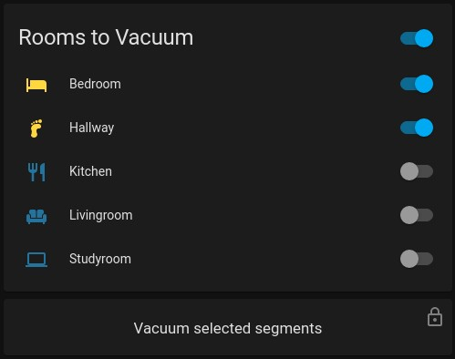

## Home Assistant Integration

### MQTT Broker
At first you need a MQTT Broker (if not already present). It is recommended to use Mosquitto for this.
Mosquitto is part of basically every linux distributions repositories. It can also be installed via docker.

### Valetudo Settings
Enable MQTT, and add the IP of your MQTT Broker to the Server.
Ensure the Autodiscovery Settings are enabled. Then Save the Settings to let the magic happen.

### Homeassistant
Homeassistant will now discover lots of entities you can now read and use.
Some basic functions like starting, stopping or returning to base can now be called with the appropriate homeassistant vacuum integration.
Since Valetudo 2021.04.0 "vacuum.send_command" is no longer supported. It is replaced by the the `mqtt.publish` service.

For more information about how the MQTT discovery works, check out the [Home Assistant documentation](https://www.home-assistant.io/integrations/mqtt/#discovery-topic).

### Examples:

These examples are written for a hypothetical Valetudo-enabled Robot with the System ID `JustForDemonstration`.<br/>
They need to be adapted to your System ID that can be found on the *System Information* page of your Valetudo instance.
The exact topic name can also be found by going to Connectivity - MQTT Connectivity.

#### Basic Services


Starting and stopping the robot
```
service: vacuum.stop
target:
  entity_id: vacuum.valetudo_justfordemonstration
```

```
service: vacuum.start
target:
  entity_id: vacuum.valetudo_justfordemonstration
```

#### Advanced Services

For the segment cleaning capability, you should first go ahead to valetudo and rename your segments. <br/>
Then you can go and check out the entity `sensor.valetudo_justfordemonstration_map_segments`, which provides a list of your segments like this:

```
'16': livingroom
'17': kitchen
'18': floor
'19': office
'20': bathroom
```

The resulting call to `mqtt.publish` to clean the bathroom, floor and livingroom in this order 2 times would then look like this:

```
service: mqtt.publish
data:
  topic: valetudo/JustForDemonstration/MapSegmentationCapability/clean/set
  payload: '{"segment_ids": ["20", "18", "16"], "iterations": 2, "customOrder": true}'
```

For more features check out the [MQTT documentation](/pages/integrations/mqtt.html).


#### Segment cleaning lovelace

**HACS requirements: [auto-entities](https://github.com/thomasloven/lovelace-auto-entities), [button-card](https://github.com/custom-cards/button-card).** 



Card configuration:
```yaml

type: vertical-stack
cards:
  - type: custom:auto-entities
    card:
      type: entities
      state_color: true
      title: Rooms to Vacuum
    filter:
      include:
        - group: group.vacuum_rooms
      exclude: []
    show_empty: true
    sort:
      method: friendly_name
      reverse: false
      numeric: false
  - type: custom:button-card
    tap_action:
      action: call-service
      service: script.vacuum_clean_segments
      confirmation: true
      service_data: {}
      target: {}
    lock:
      enabled: >-
        [[[return states['group.vacuum_rooms'].state !== 'on' ||
        states['vacuum.valetudo_justfordemonstration'].state !== 'docked']]]
      exemptions: []
    entity: script.vacuum_clean_segments
    name: Vacuum selected segments
    show_state: false
    show_icon: false

```

Now change the following config files:

`/config/configuration.yaml`
```yaml
input_boolean:
  vacuum_hallway:
    name: Hallway
    icon: mdi:foot-print
  vacuum_livingroom:
    name: Livingroom
    icon: mdi:sofa
  vacuum_bedroom:
    name: Bedroom
    icon: mdi:bed-empty
  vacuum_kitchen:
    name: Kitchen
    icon: mdi:silverware-fork-knife
  vacuum_study:
    name: Studyroom
    icon: mdi:laptop
```

Make sure your `room_id` matches the segments from the `sensor.map_segments` attributes, example:

```yaml
'16': livingroom
'17': kitchen
'18': floor
'19': study
'20': bedroom
```

`/config/customize.yaml`
```yaml
input_boolean.vacuum_hallway:
  room_id: "18"
input_boolean.vacuum_livingroom:
  room_id: "16"
input_boolean.vacuum_bedroom:
  room_id: "20"
input_boolean.vacuum_kitchen:
  room_id: "17"
input_boolean.vacuum_study:
  room_id: "19"
```

Make sure to add
```yaml
group: !include groups.yaml
homeassistant:
  customize: !include customize.yaml
```
into configuration.yaml. If you already have customizations, you can just copy them over into the the `/config/customize.yaml` file and replace the customize key.

`/config/groups.yaml`
```yaml
vacuum_rooms:
  name: Vacuum Rooms
  entities:
    - input_boolean.vacuum_bedroom
    - input_boolean.vacuum_hallway
    - input_boolean.vacuum_kitchen
    - input_boolean.vacuum_livingroom
    - input_boolean.vacuum_study
```

`/config/scripts.yaml`
```yaml

vacuum_clean_segments:
  sequence:
  - service: script.turn_on
    target:
      entity_id: script.vacuum_clean_segments_message
    data:
      variables:
        segments: '{{expand("group.vacuum_rooms") | selectattr("state","eq","on")
          | map(attribute="attributes.room_id") | list | to_json}}'
  mode: single
  alias: vacuum_clean_segments
  icon: mdi:arrow-right
vacuum_clean_segments_message:
  alias: vacuum_clean_segments_message
  sequence:
  - service: mqtt.publish
    data:
      topic: valetudo/JustForDemonstration/MapSegmentationCapability/clean/set
      payload_template: '{"segment_ids": {{segments}}}'
  mode: single

```

##### Re-using the script for single segment cleaning

The `vacuum_clean_segments_message` script accepts the variable `segments` also as manual input, please check [passing variables to script](https://www.home-assistant.io/integrations/script/#passing-variables-to-scripts) how to integrate it into a button or automation.

An example for a very rudimentary button in Home Assistant would be the following:

```yaml

type: button
tap_action:
  action: call-service
  service: script.vacuum_clean_segments_message
  service_data:
    segments: '["{{state_attr("input_boolean.vacuum_hallway", "room_id")}}"]'
  target: {}
icon: mdi:foot-print
show_state: false
show_icon: true
show_name: false

```

#### Trigger AutoEmptyDock

If your robot has an AutoEmptyDock, you can manually trigger it to empty the dustbin by adding the following script to Home Assistant:

`/config/scripts.yaml`
```yaml

vacuum_trigger_autoempty:
  alias: vacuum_trigger_autoempty
  sequence:
  - service: mqtt.publish
    data:
      topic: valetudo/JustForDemonstration/AutoEmptyDockManualTriggerCapability/trigger/set
      payload: PERFORM
  mode: single

```

### Map display

If you are on Hass.io and want the map also on your dashboards of Home Assistant, you can use the [Lovelace Valetudo Map Card
](https://github.com/TheLastProject/lovelace-valetudo-map-card).
