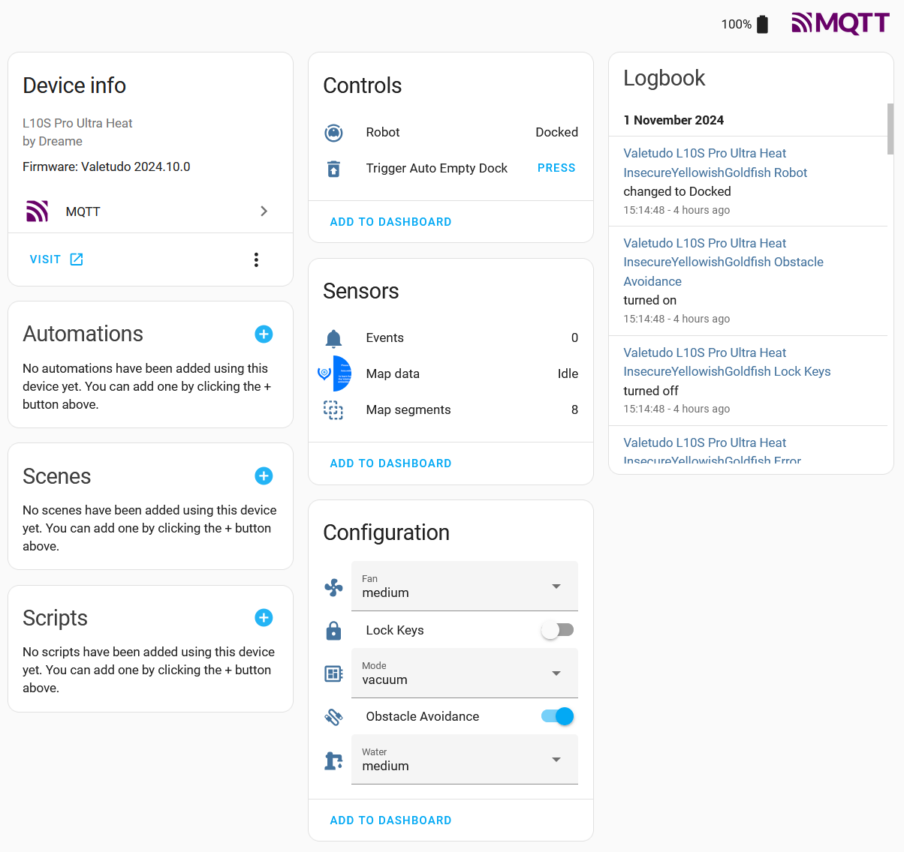
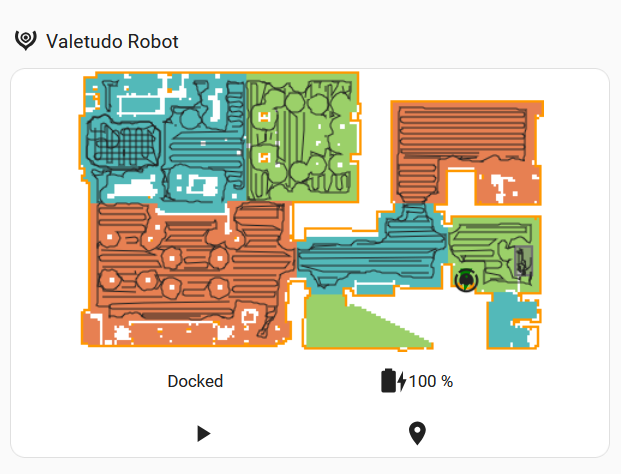
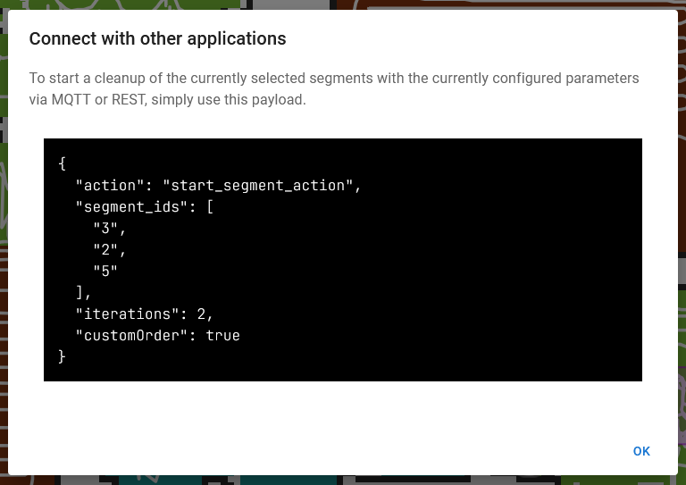
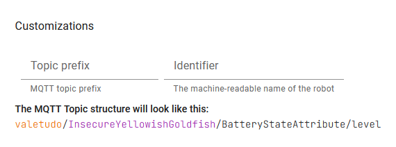

## Home Assistant Integration

The main platform you'll probably be using Valetudo with is Home Assistant.



### Connecting Valetudo to Home Assistant

Valetudo connects to Home Assistant via MQTT + the MQTT Autodiscovery Feature of Home Assistant.
This means that to connect Valetudo to Home Assistant, you will need an MQTT broker on your network

For this, Mosquitto is the recommended choice. It is available in every relevant linux distribution, can be dockered
and can also be installed as a HAOS Add-On if you run the appliance version of HA.

It also has barely any resource footprint, meaning that there's nothing to worry about if you just run it for Valetudo.
Even more so, considering that it definitely won't stay like that for long. Smarthome is a _very_ slippery slope. :)

<br/>

However you deploy the Mosquitto MQTT Broker, once deployed, you just point both Home Assistant and Valetudo at the same
broker and then automagically a new Device + its Entities will appear in Home Assistant. 

If it does not appear, make sure to check the Logs in HA, the Broker and also Valetudo.
Usually, it's a network-related or ACL issue.

Also, keep in mind that MQTT Autodiscovery will **not** create a "New devices discovered on your network" notification in Home Assistant.
The new Valetudo Device will just be there.

### Building Dashboards with Valetudo



If you'd like to use the Valetudo Iconset as part of your Dashboards, check out this repository:
[https://github.com/Hypfer/hass-valetudo-icons](https://github.com/Hypfer/hass-valetudo-icons)

To display the map of your robot in a Home Assistant dashboard, the [Valetudo Map Card](https://github.com/Hypfer/lovelace-valetudo-map-card) is used.
Setup instructions for that can be found on [hass.valetudo.cloud](https://hass.valetudo.cloud/).

### Interacting with Valetudo

Basic interaction with Valetudo is done via the autodiscovered entities.
They will allow you to observe state, toggle settings, trigger the auto-empty feature, start full cleanups and all that.

For more sophisticated use-cases like e.g. cleaning specific segments, the `mqtt.publish` action is used.

To determine the right payloads for your specific setup, in the Valetudo UI, simply configure/select the segments/zones/go-to locations
like you'd normally do and then long-press the button that would start the action.
This will bring up a dialog providing you with everything you'll need:



To determine the right topic to publish that payload to, first determine the `base topic` by visiting `Connectivity - MQTT Connectivity` in the Valetudo UI:



Then, look up the rest of the topic + any other considerations for the desired Capability in the [MQTT documentation](/pages/integrations/mqtt.html).

For the example in these screenshots, the full service call would look like this:

```
action: mqtt.publish
data:
  topic: valetudo/InsecureYellowishGoldfish/MapSegmentationCapability/clean/set
  payload: '{"action":"start_segment_action","segment_ids":["3","2","5"],"iterations":2,"customOrder":true}'
```
