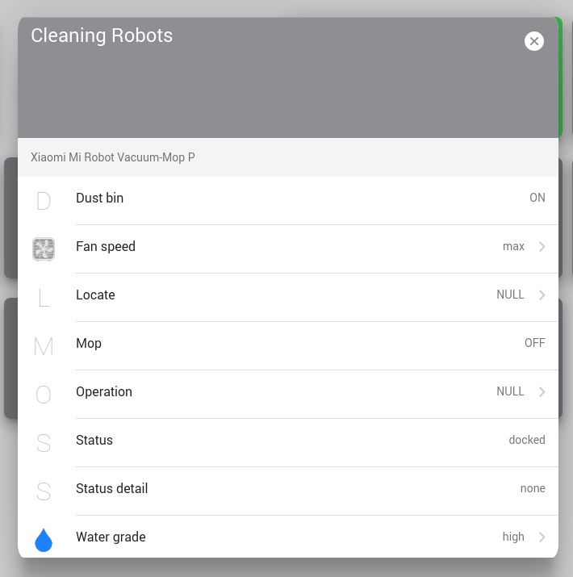

# openHAB integration

[openHAB](https://www.openhab.org/) supports MQTT autodiscovery using the Homie convention. Make sure MQTT is configured
properly and that Homie autodiscovery is enabled (see [MQTT](./mqtt)).

    
     
     

You also need to install the official MQTT binding if you don't have it installed already.

Once the MQTT binding is also configured properly, your robot should appear at Settings → Things → Inbox.
Click the new item and add it as a thing, optionally with a custom ID.

Then you can go over to your semantic model configuration, select the group you want to add it to and click
"Create Equipment from Thing". Once you assign all the semantic properties, the vacuum should show up under your
Equipment dashboard.

The map currently doesn't work and it will likely require a custom widget for the dashboard to be developed.

