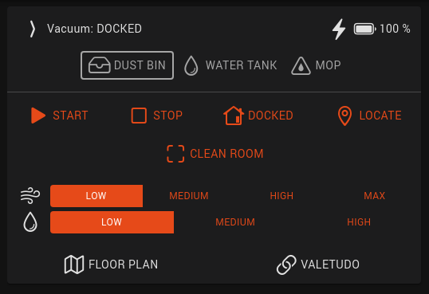
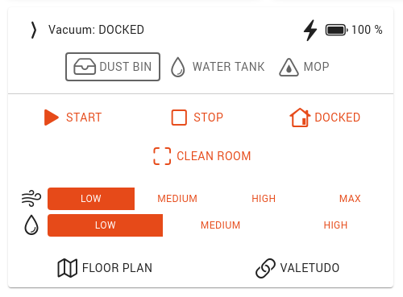
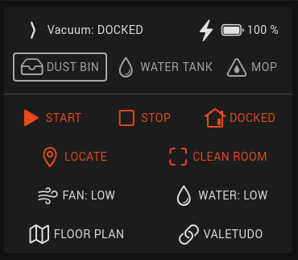
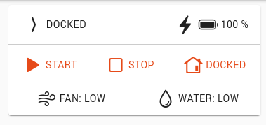

# openHAB integration

[openHAB](https://www.openhab.org/) supports MQTT autodiscovery using the Homie convention. Make sure MQTT is configured
properly and that Homie autodiscovery is enabled (see [MQTT](./mqtt)).

<div style="text-align: center;">
    <a href="https://homieiot.github.io" rel="noopener" target="_blank">
        
    </a>
    <br>
    <br>
</div>

Unlike Home Assistant, openHAB does not come with a vacuum widget out of the box. It does, however, allow adding custom
widgets for complex devices.

A collection of custom widgets, rules and integrations for openHAB is available on GitHub:
[github.com/Hypfer/Valetudo-Openhab](https://github.com/Hypfer/Valetudo-Openhab)

This document tries to explain in enough detail how to add a Valetudo robot to openHAB with the goal of minimizing
inconsistencies between different users setups. This will make it easier to share custom integrations among the Valetudo
community.



<div style="text-align: center">

 
 

</div>

## Adding the robot

1. Before starting, go to Valetudo and refresh the status, navigate a few pages. This will ensure that all MQTT topics
   are correctly populated and ready for openHAB.
2. You need to install the official MQTT binding if you don't have it installed already: you can install it from
   Settings → Add-ons → Bindings -> [+ button] → MQTT Binding.
3. Create an MQTT broker by navigating to Things → [+ button] → MQTT Binding → MQTT Broker, then configure the same
   broker that you configured for Valetudo.
4. Go back to Things → [+ button] → MQTT Binding, but this time, if you configured the broker correctly, you should]
   find your Valetudo instance on top, with a subtitle `mqtt:homie300`. Choose a unique name for your robot.
5. Now navigate to "Model"
   
6. Select the room you want to add your robot to, then click "Create Equipment from Thing" and select your newly created
   Valetudo Homie thing. Fill in the name, etc, then scroll towards the bottom before saving.
7. Enable and configure the channels you want to import from the vacuum. You don't have to select all of them, and you
   don't need to add all the items you configure to your semantic model (to not add them to the model, set the
   \"Semantic class\" to \"None\"). The table below shows the recommended channels to enable and suggested parameters.
   
   
   
   
   
   | Channel        | Type      | Category     | Semantic class | Semantic Property | Notes        |
   | -------------- | --------- | ------------ | -------------- | ----------------- | ------------ |
   | Dust bin       | Switch    |              | Point          | Presence          |              |
   | Water tank     | Switch    |              | Point          | Presence          | Optional     |
   | Mop            | Switch    |              | Point          | Presence          | Optional     |
   | Fan speed      | String    | fan          | Setpoint       | Level             |              |
   | Water grade    | String    | water        | Setpoint       | Level             | Optional     |
   | Status         | String    |              | Point          | None              |              |
   | Status detail  | String    |              | Point          | None              |              |
   | Battery level  | Number    | batterylevel | Point          | Level             |              |
   | Battery status | String    | battery      | Point          | None              |              |
   | Operation      | String    |              | Point          | None              |              |
   | Clean segments | String    |              | None           | None              | Optional     |
   | Locate         | String    |              | Point          | None              | Optional     |
   | Map            | String    |              | None           | None              | Change item to image type |
   | Map segments   | String    |              | None           | None              | Optional     |

   

8. Once the vacuum is added and linked, we are ready to add the custom widget. Go to Developer Tools → Widgets →
   [+ button] and paste the widget code at the end of this page.
   
   You can test it by selecting "Set Props" on the bottom, and adding the settings. You can also change it as you wish.

## Refresh Homie channels after a Valetudo upgrade

Due to a bug, openHAB will not register any new channels added after first setup, such as after an upgrade that adds
new features (see [openhab/openhab-addons/#7467](https://github.com/openhab/openhab-addons/issues/7467)).

A workaround is to delete the thing and recreate it with the same name. This will not affect item links, widgets or
anything.

1. Navigate to Settings → Things → [your robot thing].
2. In the Code tab, copy the configuration and save it for later
3. Click on Delete Thing at the bottom of the page.
4. In the things page, add a new thing → MQTT Binding
5. The vacuum won't be discovered since you just deleted it. Under "Add manually" select "Homie MQTT Device"
6. Now, copying from the configuration you saved earlier, fill in as follows:
   - UID: the last part after the last colon of the `UID` field in the config - if your UID in the config was
     `mqtt:homie300:mosquitto:robot` you have to type `robot`. Ensure that the generated "Identifier" field matches the
     old one.
   - Label: `label`
   - Bridge: click on "Bridge" and select your MQTT bridge thing
   - Device ID: `configuration.deviceid`
   - MQTT Base Prefix: `configuration.basetopic`
7. Double check that you didn't mistype any values and save

The robot thing should now appear, the old channel links should still be attached, and the new channels should be there.

If Valetudo decided to rename some channels (for example: water grade and fan speed properties will change from
`intensity` to `preset` after v2021.04) they won't be relinked automatically.

To relink them:

1. Open your newly recreated thing
2. Navigate to the Channels tab
3. Expand the items that were unlinked
4. Select "Add link to item..."
5. Ensure that the option "Use an existing item" is checked
6. Click "Item to link" and assign it back to the previous item

## Setting custom options, friendly names and order

You will likely notice that options for fan speed and water grade are all lowercase and in a random order. Also, you
will see that Clean segments does not have any options.

This is easy to fix from settings.

1. Go to Settings → Items
2. Find the item you want to change (fan speed/water grade/clean segments)
3. Click Add Metadata and select Command Options
4. Add your custom options in the `command=Friendly name` format, one per line.
   For example, for fan speed presets:
   
   ```
   low=Low
   medium=Medium
   high=High
   max=Max
   ```
   
   For "Clean segments":

   ```
   10=Kitchen
   17=Living room
   11=Bathroom
   13=Bedroom
   ```

