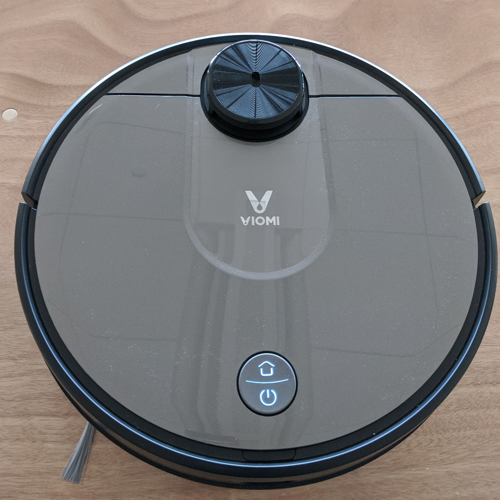

# Supported 3irobotix Devices
[Shenzhen 3irobotix Co.,Ltd.](http://www.3irobotics.com/en/) produces white-label vacuum robots.
They are sold under various brands. For example `Cecotec Conga` or `Viomi`.
Since they are basically the same products, hopefully, Valetudo will eventually support all of them.

For now however, there's only experimental support for the Viomi-branded ones which run a customized firmware
including a miio interface.

If you want to find out more about robot vacuum research,
check out [Dennis' Vacuum Robot Overview](https://dontvacuum.me/robotinfo/).

## Table of Contents

1. [CRL-200S](#CRL-200S)

## CRL-200S 
This one is also known as the

* Mijia STYJ02YM **viomi.vacuum.v7**

and there are multiple Device IDs in the Mi ecosystem as well:

* viomi.vacuum.v6
* viomi.vacuum.v7
* viomi.vacuum.v8

### Features
These are the Hardware specs

| Property         | Value    | Notes |
|------------------|----------|-------|
| Height           | 9.45 cm  |       |
| Width            | 35 cm    |       |
| Battery Capacity | 3200 mAh |       |
| Dustbin Size     | 600 ml   |       |
| Suction Power    | 2000 Pa  |       |
| Climbing Ability | 20 mm    |       |
| Washable Filter  | ❌        |       |
| Mop Feature      | ✔        |       |
| Water Pump       | ✔        |       |

And here are the Software specs.
This table is based on Viomi V7 FW Version 46

| Feature             | Value | Valetudo Support | Notes                                                                       |
|---------------------|-------|------------------|-----------------------------------------------------------------------------|
| Zoned Cleanup       | ✔     | ✔                |                                                                             |
| Persistent Maps     | ✔     | ✔                |                                                                             |
| Virtual Walls       | ✔     | ❌                |                                                                             |
| Room Detection      | ✔     | ✔                 |                                                                             |
| Carpet Detection    | ❌     | ❌                |                                                                             |
| Bin State Reporting | ❌     | ❌                | only reports the kind of bin, not any fill level                            |
