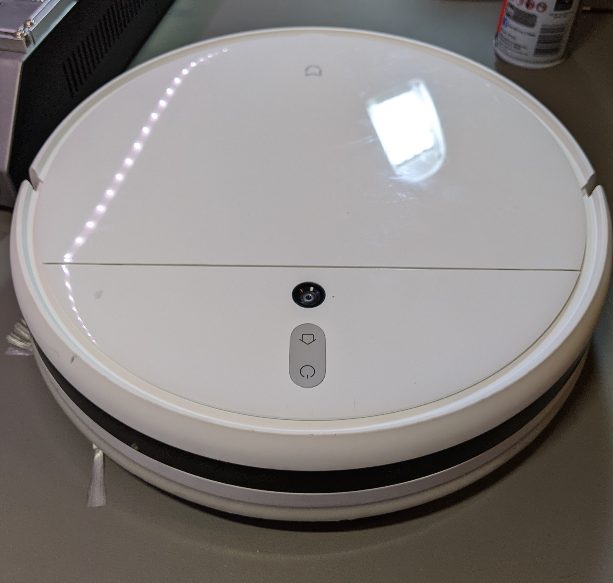
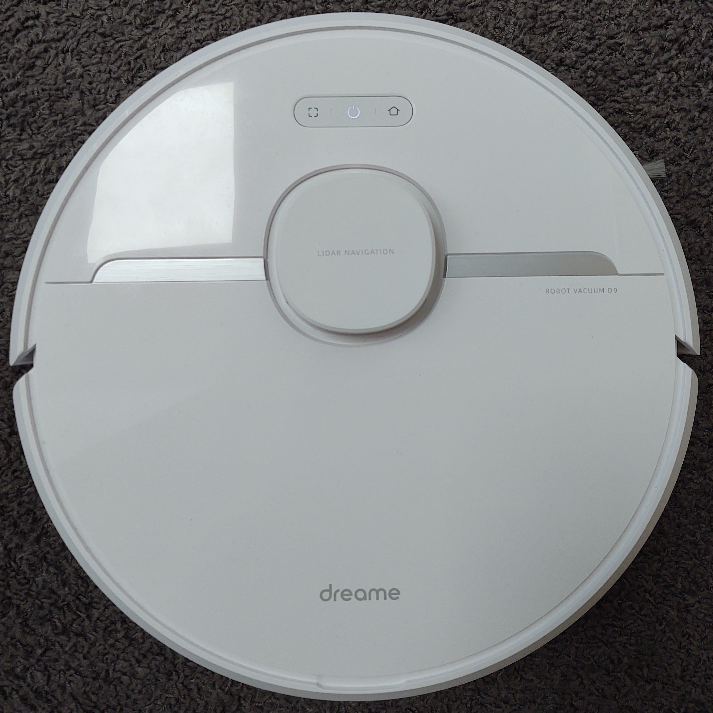

# Supported Dreame Devices

This is an incomplete list of supported dreame devices. Feel free to open a PR to extend this. 
If you want to see everything that is supported by the codebase, check out the autogenerated [supported robots](https://valetudo.cloud/pages/general/supported-robots.html) page.

1. [Introduction](#introduction)
2. [1C](#1c)
    1. [Features](#1c-features)
3. [D9](#d9)
   1. [Features](#d9-features)
    
## Introduction
While acquiring root on dreame vacuums is possible, it is not yet publicly available since the tooling for it is still in development.

This will change soon-ish.

## 1C 

This one is sold under different names including **Mi Robot Vacuum Mop** and **Xiaomi MiJia 1C**:
Its mi id is *dreame.vacuum.mc1808*.

The identifier **STYTJ01ZHM** being the chinese version and **SKV4093GL** the one for the international market.

### 1C Features 
These are the Hardware specs

| Property         | Value    | Notes |
|------------------|----------|-------|
| Height           | 8.15 cm   |       |
| Width            | 35 cm  |         |
| Battery Capacity | 2400 mAh |       |
| Dustbin Size     | 600 ml   |       |
| Suction Power    | 2500 Pa  |       |
| Climbing Ability | 20 mm    |       |
| Washable Filter  | ❌       |       |
| Mop Feature      | ✔       |       |
| Water Pump       | ✔       |       |

The software specs are TBD

## D9 

The mi id of this robot is *dreame.vacuum.p2009*.

### D9 Features 
These are the Hardware specs

| Property         | Value    | Notes |
|------------------|----------|-------|
| Height           | 9.7 cm   |       |
| Width            | 35 cm    |       |
| Battery Capacity | 5200 mAh |       |
| Dustbin Size     | 570 ml   |       |
| Suction Power    | 3000 Pa  |       |
| Climbing Ability | 20 mm    |       |
| Washable Filter  | ✔       |       |
| Mop Feature      | ✔       |       |
| Water Pump       | ✔       |       |

The software specs are TBD
