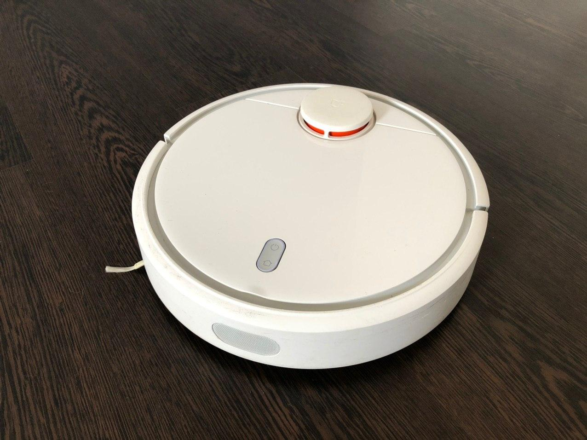
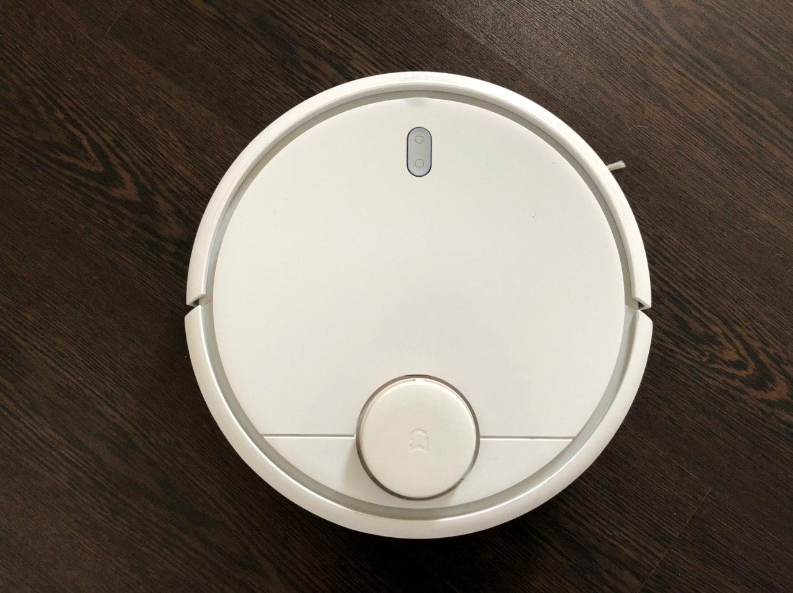
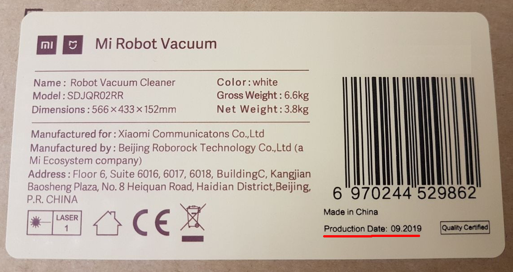
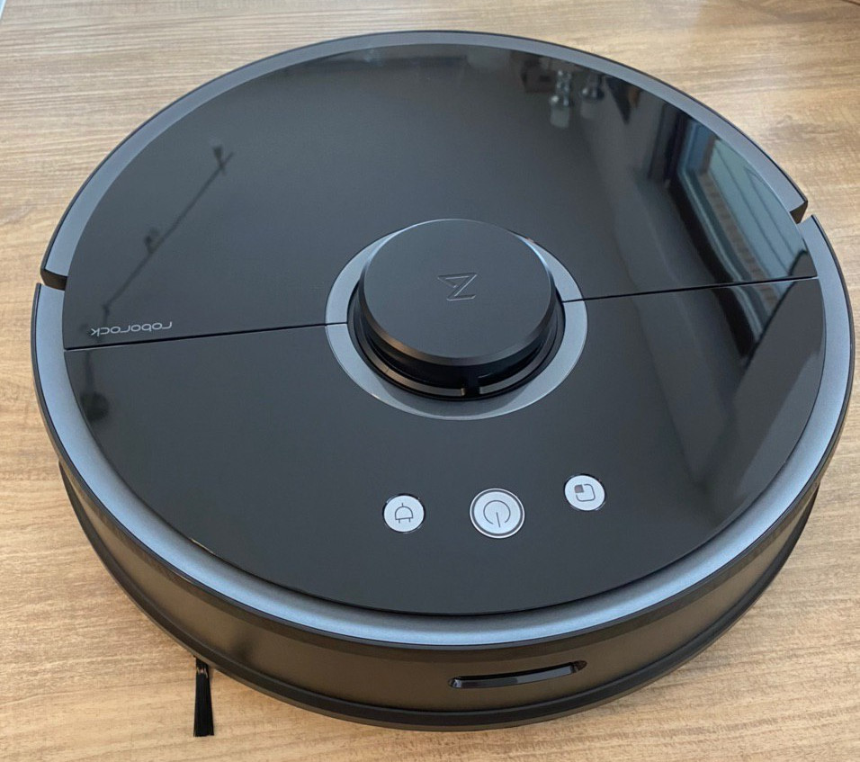
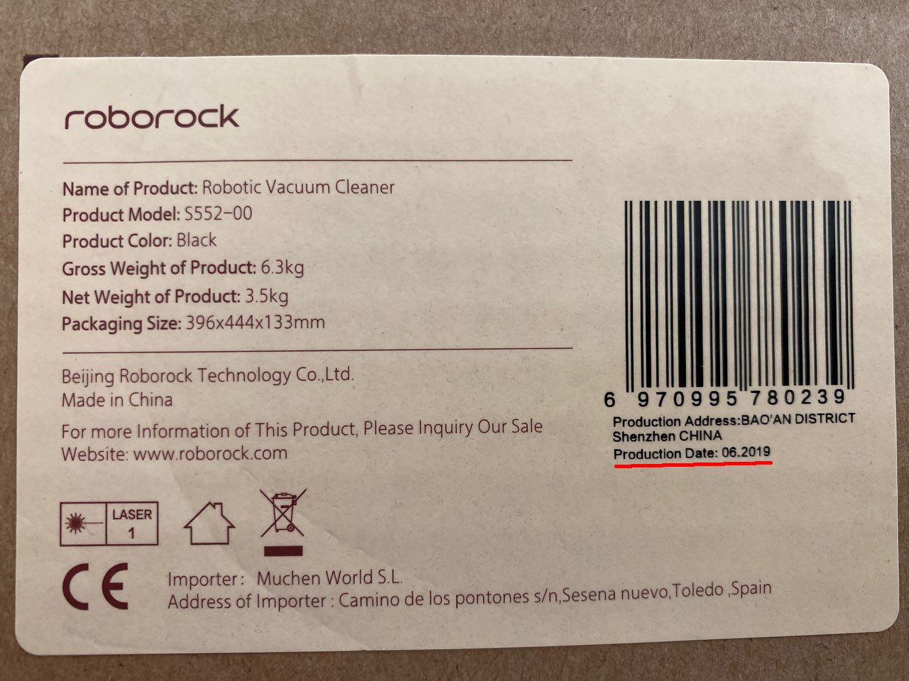

# Supported Roborock Devices

This is an incomplete list of supported roborock devices. Feel free to open a PR to extend this. 
If you want to see everything that is supported by the codebase, check out the autogenerated [supported robots](https://valetudo.cloud/pages/general/supported-robots.html) page.

1. [Introduction](#introduction)
2. [Gen 1](#gen-1)
    1. [Features](#gen-1-features)
3. [Gen 2](#gen-2)
    1. [Features](#gen-2-features)

## Introduction
Valetudo started as a cloud replacement for Roborock Vacuums after
[Dennis Giese's 34c3 Talk](https://media.ccc.de/v/34c3-9147-unleash_your_smart-home_devices_vacuum_cleaning_robot_hacking)
about getting root on these rather cheap devices laid the foundations to do so.

Since then, it has spread to other Vacuums by different Vendors. 😱

If you want to find out more about robot vacuum research,
check out [Dennis' Vacuum Robot Overview](https://dontvacuum.me/robotinfo/).

## Gen 1 

This is the Gen 1 Roborock Vacuum sold under the Xiaomi Brand as the 
**Xiaomi Mi SDJQR02RR** aka **Mi Robot Vacuum** and identifying itself as the *rockrobo.vacuum.v1*

To identify a Gen 1, simply look at the Lidar Tower Placement as well as the Button count.
There are only two Buttons on this model.

Also, the charging contacts are found on the back side of the robot.

Please note that Gen 1 Vacuums with a production [date >= 2019-09 (ver >= 4004)](https://twitter.com/dgi_DE/status/1273742178783805441) may come with newer firmwares preinstalled which disables
local OTA and thus **making the Installation of Valetudo impossible without opening the device.**

We don't know yet when they've exactly started manufacturing them like that, however there's at least
one report with a production date of 2020-03.

### Gen 1 Features 
These are the Hardware specs

| Property         | Value    | Notes |
|------------------|----------|-------|
| Height           | 9.6 cm   |       |
| Width            | 34.5 cm  |       |
| Battery Capacity | 5200 mAh |       |
| Dustbin Size     | 420 ml   |       |
| Suction Power    | 1800 Pa  |       |
| Climbing Ability | 15 mm    |       |
| Washable Filter  | ❌       |       |
| Mop Feature      | ❌       |       |
| Water Pump       | ❌       |       |

## Gen 2 

This is the Gen 2 Roborock Vacuum. It's an S55 to be precise.
The white model is called S50 and there's also a red-ish S51.

It will be referred to as the S5 or S5* and identifies itself as the *roborock.vacuum.s5*.

To identify an S5, check the Lidar Tower Placement as well as the Button Count and Style.
There are _three_ Buttons on an S5.

**Please note that the S5 Max is a different Model than the S5.**

Make sure to always check the production date of the unit, since units with a production [date >= 2019-11 (ver >= 2008)](https://twitter.com/dgi_DE/status/1273742178783805441) may come with
newer firmwares preinstalled which disables local OTA and thus **making the Installation of Valetudo impossible without opening the device.**

Compared to the Gen 1, the Gen 2 can climb higher obstacles and features persistent maps.

### Gen 2 Features 
These are the Hardware specs

| Property         | Value    | Notes |
|------------------|----------|-------|
| Height           | 9.6 cm   |       |
| Width            | 35 cm    |       |
| Battery Capacity | 5200 mAh |       |
| Dustbin Size     | 480 ml   |       |
| Suction Power    | 2000 Pa  |       |
| Climbing Ability | 20 mm    |       |
| Washable Filter  | ✔       |       |
| Mop Feature      | ✔       |       |
| Water Pump       | ❌       |       |
